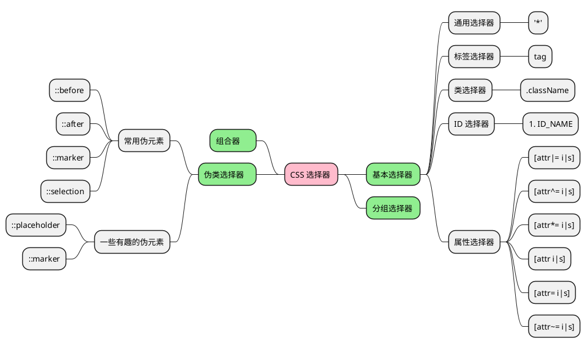

## 选择器分类



### 基本选择器

基本选择器主要争对于 `tag` 、`id` 、`class` 这种简单标签，可以结合一些组合器，提高作用属性的优先级，实现局部样式覆盖。比如：

```html
<div class="table">
	<div class="plate" id="vegetable_panel"></div>
	<div class="plate" id="beef_panel"></div>
	<div class="plate" id="big_panel">
		<div class="more_plate">
			<plate class="other_panel" />
		</div>
	</div>
</div>
<style>
	* { color:red; }
	#beef_panel { color: blue; }
	.plate { }
	div { }
	plate { }
	/** 组合器 */
	* div { } /*所有元素下的 div*/
	div>div { } /*div 下的 div*/
	/*兄弟选择器*/
	div+div{ } /*div 之后的一个相邻兄弟节点（强调一个相邻）*/
	div~div{ } /*div 之后的所有兄弟节点（强调所有）/
	/*分组选择器*/
	div,plate {} /**,分割的都匹配*/
	/*等价于*/
	div{ }
	plate{ }
	/**同时是 div 具有类名.plate 的选择器*/
	div.plate{ }
</style>
```

需要注意的是，在 `CSS` 中请不要以 `{}` 为一个单位思考，而是争对某一个属性值来思考，比如比如 `div{color:red}`，你应该关心的是 `color` 在 `div` 这个选择器下的优先级和值。

### 属性选择器

无非就那一套

- 是否有 \[attr\]
- 第一个是否匹配 \[attr^=value\]
- 最后一个是否匹配 \[attr$=value\]
- 全匹配，还是忽略大小写匹配 \[attr=value i|s \]
- 是否包含匹配
- 是否不匹配的否定词
- 比较特殊好玩的一个  
	`[attr|=value]`  
	表示带有以  *attr*  命名的属性的元素，属性值为"value"或是以"value-"为前缀（`-`）开头。有一种命名空间的含义。

### 伪类选择器

**伪类选择器**，是对于**特殊身份**（**nth-child** 系列、etc.），或者某一个节点的特殊状态(**hover**、 **active**、**link**、**visited**、etc.)进行选择的工具。  
%%TODO 简单分类%%

#### 表单相关

[:autofill](https://developer.mozilla.org/zh-CN/docs/Web/CSS/:autofill) : 设置自动填充部分的样式  
[:blank](https://developer.mozilla.org/zh-CN/docs/Web/CSS/:blank) : 选择用户输入为空的输入框  
[:checked](https://developer.mozilla.org/zh-CN/docs/Web/CSS/:checked) : 选择任何处于选中状态的 **radio**  
[:default](https://developer.mozilla.org/zh-CN/docs/Web/CSS/:default): 设置之前默认设置的表单元素，例如：  
[:disabled](https://developer.mozilla.org/zh-CN/docs/Web/CSS/:disabled) 、 [:enabled](https://developer.mozilla.org/zh-CN/docs/Web/CSS/:enabled) :这两个是一对对立的东西，表示是否启用的元素。  
[:valid](https://developer.mozilla.org/zh-CN/docs/Web/CSS/:valid) :表示内容[验证](https://developer.mozilla.org/zh-CN/docs/Web/HTML/HTML5/Constraint_validation "This is a link to an unwritten page")正确的 [`<input>`](https://developer.mozilla.org/zh-CN/docs/Web/HTML/Element/input)  或其他  [`<form>`](https://developer.mozilla.org/zh-CN/docs/Web/HTML/Element/form)  元素

例：

<div class="playground">
<form>
	<label for="name">Name:</label>
	<input name="name" type="text">
	<label for="emp">Employed:</label>
	<select name="emp" disabled>
		<option>No</option>
		<option>Yes</option>
	</select>
	<label for="empDate">Employment Date:</label>
	<input name="empDate" type="date" disabled>
	<label for="resume">Resume:</label>
	<input name="resume" type="file"><div>
	<input type="radio" name="season" id="spring"><label for="spring">Spring</label><input type="radio" name="season" id="summer" checked><label for="summer">Summer</label><input type="radio" name="season" id="fall"><label for="fall">Fall</label><input type="radio" name="season" id="winter"><label for="winter">Winter</label></div>
</form>
<style>
.playground input:default {
  box-shadow: 0 0 2px 1px coral;
}
.playground input:default + label {
  color: coral;
}
label {
	margin-top: 1em;
}
*:enabled {
	background-color: gold;
}
</style>
</div>

---

#### 超链接相关

[:any-link](https://developer.mozilla.org/zh-CN/docs/Web/CSS/:any-link)

#### 元素状态相关

[:empty](https://developer.mozilla.org/zh-CN/docs/Web/CSS/:empty)  
[:first](https://developer.mozilla.org/zh-CN/docs/Web/CSS/:first)  
[:first-child](https://developer.mozilla.org/zh-CN/docs/Web/CSS/:first-child)  
[:first-of-type](https://developer.mozilla.org/zh-CN/docs/Web/CSS/:first-of-type)  
[:focus](https://developer.mozilla.org/zh-CN/docs/Web/CSS/:focus)  
[:focus-visible](https://developer.mozilla.org/zh-CN/docs/Web/CSS/:focus-visible)  
[:focus-within](https://developer.mozilla.org/zh-CN/docs/Web/CSS/:focus-within)  
[:fullscreen](https://developer.mozilla.org/zh-CN/docs/Web/CSS/:fullscreen)  
[:future(en-US)](https://developer.mozilla.org/en-US/docs/Web/CSS/:future "Currently only available in English (US)")实验性  
[:host-context()](https://developer.mozilla.org/zh-CN/docs/Web/CSS/:host-context) 1 w 4.  
[:last-child](https://developer.mozilla.org/zh-CN/docs/Web/CSS/:last-2 w 2. )  
[:nth-of-type()](https://developer.mozilla.org/zh-CN/3 w 4. Web/CSS/:nth-of-type)  
[:only-of-type](https://developer.mozilla.org/zh-CN3 w 6. /Web/CSS/:only-of-type)  
[:out-of-range](https://developer.mozilla.org/zh-3 w 8. cs/Web/CSS/:out-of-range)  
[:popover-open(en-US)](https://developer.mozilla.org/en-US/docs/Web/CSS/:popover-open "Currently only available in English (US)")实验性  
[:read-write](https://developer.mozilla.org/zh-CN/docs/Web/CSS/:read-write)  
[:right](https://developer.mozilla.org/zh-CN/docs/Web/CSS/:right)  
[:scope](https://developer.mozilla.org/zh-CN/docs/Web/CSS/:scope)  
[:target-within(en-US)](https://developer.mozilla.org/en-US/docs/Web/CSS/:target-within "Currently only available in English (US)")实验性  
[:user-valid(en-US)](https://developer.mozilla.org/en-US/docs/Web/CSS/:user-valid "Currently only available in English (US)")  
[:where()](https://developer.mozilla.org/zh-CN/docs/Web/CSS/:where)

### 伪元素选择器

[::-webkit-inner-spin-button(en-US)](https://developer.mozilla.org/en-US/docs/Web/CSS/::-webkit-inner-spin-button "Currently only available in English (US)") 改变输入框旁边的操作按钮的样式。  
[::-webkit-outer-spin-button(en-US)](https://developer.mozilla.org/en-US/docs/Web/CSS/::-webkit-outer-spin-button "Currently only available in English (US)")非标准

#### 设置进度条的样式

[::-webkit-progress-bar](https://developer.mozilla.org/zh-CN/docs/Web/CSS/::-webkit-progress-bar)  
[::-webkit-progress-inner-element](https://developer.mozilla.org/zh-CN/docs/Web/CSS/::-webkit-progress-inner-element)  
[::-webkit-progress-value](https://developer.mozilla.org/zh-CN/docs/Web/CSS/::-webkit-progress-value)

#### 设置滚动条的样式

[::-webkit-scrollbar](https://developer.mozilla.org/zh-CN/docs/Web/CSS/::-webkit-scrollbar)  
[::-webkit-slider-thumb](https://developer.mozilla.org/zh-CN/docs/Web/CSS/::-webkit-slider-thumb) 非标准

#### 设置文件选择按钮的样式

[::file-selector-button](https://developer.mozilla.org/zh-CN/docs/Web/CSS/::file-selector-button)

[::marker](https://developer.mozilla.org/zh-CN/docs/Web/CSS/::marker)  
[::placeholder](https://developer.mozilla.org/zh-CN/docs/Web/CSS/::placeholder)  
[::selection](https://developer.mozilla.org/zh-CN/docs/Web/CSS/::selection)  
[::target-text](https://developer.mozilla.org/zh-CN/docs/Web/CSS/::target-text)  
[::view-transition(en-US)](https://developer.mozilla.org/en-US/docs/Web/CSS/::view-transition "Currently only available in English (US)")实验性  
[::view-transition-group(en-US)](https://developer.mozilla.org/en-US/docs/Web/CSS/::view-transition-group "Currently only available in English (US)")实验性  
[::view-transition-image-pair(en-US)](https://developer.mozilla.org/en-US/docs/Web/CSS/::view-transition-image-pair "Currently only available in English (US)")实验性  
[::view-transition-new(en-US)](https://developer.mozilla.org/en-US/docs/Web/CSS/::view-transition-new "Currently only available in English (US)")实验性  
[:: view-transition-old(en-US)](https://developer.mozilla.org/en-US/docs/Web/CSS/::view-transition-old "Currently only available in English (US)")实验性

### @规则

[@charset](https://developer.mozilla.org/zh-CN/docs/Web/CSS/@charset)  
 [@color-profile(en-US)](https://developer.mozilla.org/en-US/docs/Web/CSS/@color-profile "Currently only available in English (US)")  
 [@container(en-US)](https://developer.mozilla.org/en-US/docs/Web/CSS/@container "Currently only available in English (US)")  
 [@counter-style](https://developer.mozilla.org/zh-CN/docs/Web/CSS/@counter-style)  
 [@document](https://developer.mozilla.org/zh-CN/docs/Web/CSS/@document)非标准已弃用  
 [@font-face](https://developer.mozilla.org/zh-CN/docs/Web/CSS/@font-face)  
 [@font-feature-values](https://developer.mozilla.org/zh-CN/docs/Web/CSS/@font-feature-values)  
 [@font-palette-values(en-US)](https://developer.mozilla.org/en-US/docs/Web/CSS/@font-palette-values "Currently only available in English (US)")  
 [@import](https://developer.mozilla.org/zh-CN/docs/Web/CSS/@import)  
 [@keyframes](https://developer.mozilla.org/zh-CN/docs/Web/CSS/@keyframes)  
 [@layer](https://developer.mozilla.org/zh-CN/docs/Web/CSS/@layer)  
 [@media](https://developer.mozilla.org/zh-CN/docs/Web/CSS/@media)  
 [@namespace](https://developer.mozilla.org/zh-CN/docs/Web/CSS/@namespace)  
 [@page](https://developer.mozilla.org/zh-CN/docs/Web/CSS/@page)  
 [@property](https://developer.mozilla.org/zh-CN/docs/Web/CSS/@property)  
 [@supports](https://developer.mozilla.org/zh-CN/docs/Web/CSS/@supports)

## 选择器的优先级

- `important` 最大，高于一切，包括 `id` 选择器，藏匿于无形，非必要，不适用
- `id` 选择器其次，当前网页唯一值。
- `class` 再次
- 然后是伪类选择器

当然选择器是可以叠加计算的，《CSS REFACTORING》中提到了算法的过程。

具体算法如下：

- 将数字放到（important，a，b，c，d）中
- `important` ，有 `1` 无 `0`。
- `a` 由内联样式决定，有 `1` 无 `0`。
- `b` 等于是**ID 选择器**次数。
- `c`  的值等于**类选择器**和**属性选择器**和**伪类**出现的总次数。
- `d` 则是标签选择器和伪元素的次数。

举个例子

```html
<div class="table">
	<div id="plate" style="color:red;"></div>
</div>

<style>
	.table>#plate
	/**color 这个属性的值所受到的优先级 color: red;(0,1,0,0,0) */
	{}

	*
	/**color 这个属性的值所受到的权重值为 (1,0,0,0,1)，所以哪怕是最校的通用选择器都能顶掉 */
	{
		color: red !important;
	}
</style>
```

此外还有层叠式的效应，也就是在同级别的优先级下。后面的会覆盖前面的。

> [!TIP]  
> 当你不知道你的选择器是否生效的时候，你可以尝试使用 `border: solid !important`;来验证。
