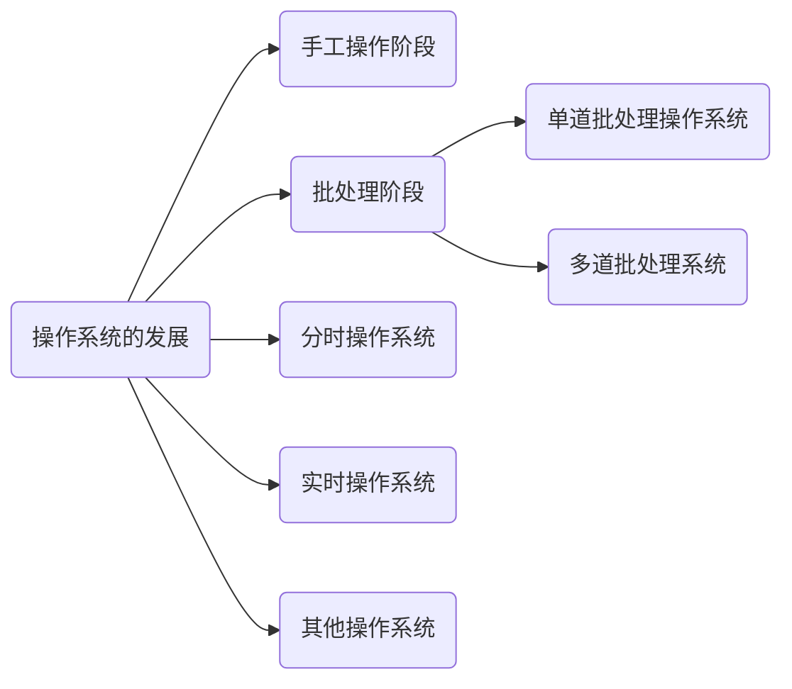

## 手工操作阶段(纸带机)

- 用户独占主机
- CPU 资源利用不充分
- 主要做偏向数理运算

## 批处理阶段

批处理阶段可以认为是**模块化**的一个阶段,将指令进行打包存储(物理打包💦.

### 单道批处理系统

主要使用磁带作为载体,引入了**脱机输入/输出技术**,并由监督程序复杂作业的输入输出.

### 主要优点

- 相比于手工接线,能避免这样的信息传输矛盾,资源利用率有所提升

    

> 这里就相当于人工充当了 I/O 接口,和 DMA

- 代码/脚本 更便于保存(相对而言

### 主要缺点

- 内存中仅能有一道程序运行,且 CPU 仍然有大量时间空闲等待 I/O 完成.

- 一次性消耗,如果出现 BUG ,很难修复,需要重新打孔☢

### 多道批处理系统(操作系统的正式诞生

每次往计算机内存中输入多道程序,并引入了中断技术,有操作系统负责管理这些程序的并发运行.

过程和单道批处理系统差不多,只不过是可以向计算机**内存**中调入多道程序,让他们可以**并发**运行. --- 基本特征

#### 主要优点

- 开始出现**并发**概念,**共享**计算机资源,CPU利用率大幅提升,让人工相对而言解放.

#### 主要缺点

- 用户响应时间长,没有人机交互功能(用户提交自己的作业之后只能等待计算机处理完成,无法介入控制自己的作业执行.

## 分时操作系统(RR

计算机中 **CPU** 以时间片(**10~100ms**)为单位轮流为各个用户/作业服务,各个用户可以通过终端与计算机进行交互.

这个在后续的 CPU 调度算法中会继续讲到。

### 主要优点

- 用户请求就可以被响应，解决了人机交互问题，允许多个用户使用同一台电脑，并且用户对计算机操作是相互独立的。

### 主要缺点

- 不能优先处理一些紧急任务，操作系统对各个**用户/作业**都是完全公平的，循环的为每一个 用户/作业 服务时间片，不区分任务的紧急性（同时这也是 RR 的缺点

## 实时操作系统

为了解决分时操作系统不区分任务紧急性，导致任务饿死的情况，所以实时操作系统诞生。

利用这种调度策略，会更加有效的分配资源问题，让任务优先级可控。

### 主要优点

- 响应紧急任务更加及时，紧急任务可以插队

> 实时操作系统分为：
>
> - 硬实时系统（必须在绝对严格的规定时间内完成处理，如导弹控制系统，自动驾驶系统）
> - 软实时系统（能偶尔违反时间规定，如12306火车退票系统，有时候数据并不是实时的）

## 其他现代操作系统

- 网络操作熊：网络操作系统是伴随网络的发展出现的，对于网络资源的管理，比如网络邻居。
- 分布式操作系统：随着时代的发展，并发性和存储容量要求越来越高，需要有多个节点处理更多的数据，特点是分布式和并行性，各个节点平等的完成工作。
- 个人操作系统：面向于用户交互的操作系统，比如  **Win10**,**Darwin**,**Ubuntu**…

## 总结

