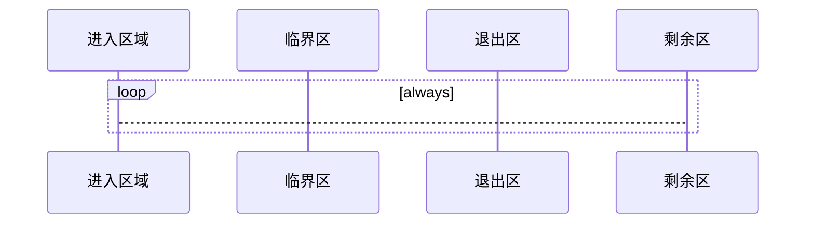
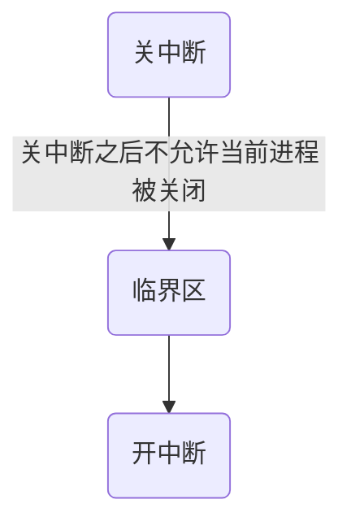
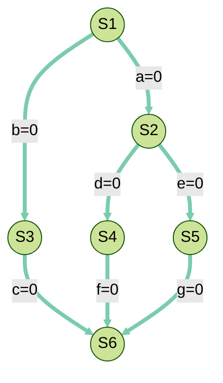

## 进程同步的概念

### 临界资源

临界资源指一个时间段内只允许一个进程使用的资源（互斥资源）。

> 例如物理设备，内存缓冲区等都是临界资源

在每一个进程中，访问临界资源的那部分指令被称为临界区，对临界区的访问可以分为四个阶段：



- **进入区**：检查是否可以进入临界区，若可以进入，则设置正在访问临界资源的标志，以阻止其他进程进入临界区。
- **临界区**（**临界段**）：进程中访问临界区的一段代码。
- **退出区**：将正在访问临界资源的标志解除。
- **剩余区**：代码中其他部分。

<span style="color:red;">🧡进入区和退出区负责实现互斥</span>

## 同步

**同步**：亦称为**直接制约关系**，他是指完成某种任务而建立的**两个或多个**进程，这些进程因为需要在某些位置上协调他们的工作次序而产生的制约关系。进程间的**直接制约关系**就是因为他们的相互合作。

## 互斥

对临界资源的访问，**必须**互斥的进行。

互斥：亦称**间接制约关系**，进程互斥指当一个进程访问临界资源时，另一个想要访问该临界资源的进程必须等待。当前访问临界资源的进程访问结束。释放该资源之后，另一个进程才能去访问临界资源。

### 互斥的原则

- 空闲让进：临界区空闲时，可以允许一个请求进入临界区的进程，立即进入临界区。
- 忙则等待：若已有进程进入临界区时，其他试图进入临界区的进程必须等待。
- 有限等待：对请求访问的进程，因保证能在有限时间内进入临界区（保证不饥饿）
- 让权等待：当进程不能进入临界区时，应立刻释放处理机，防止进程忙等待。

> 一句话，就是 **（处理机or资源）物尽其用**，**(能力or资源)不够就等**

## 临界区互斥的实现

### 单标志法

一个进程在访问完临界区后会把临界区资源的权限交给另一个进程，也就是说每个进程进入临界区的权限只能由前辈（另一个程序赋予）

```cpp
int turn = 0;
void p0 (){
    while (turn != 0);
    critical section;
    turn = 1;
    remainder section;
}
void p1(){
    while(turn != 1);
    critical section;
    turn = 0;
    remainder section;
}

```

就如同单锁一样，自己在用的时候，其他进程就不能用，自己用完了，立马就把占有权给人家。

> 好比如：现在是桌上只有一双筷子，有A跟B两个人，一开始先把筷子给A，A吃完后直接就把筷子洗干净给B了，然后说你吃完再把筷子洗干净给我，结果B无语了，他也没说要用筷子吃东西，然后A就是说不管，你必须吃完过后再把筷子给我，结果A自己又想吃的时候结果没有筷子用，因为筷子还在B那里呢，B还在纳闷A怕不是有什么大病。
> 该比喻来自 CSDN「叫我蘑菇先生」的[原创文章](https://blog.csdn.net/weixin_43305485/article/details/120754983)

### 双标志先检查法

设置一个数组，相应元素标识进程访问的资源的意愿。

```cpp
bool flag[] = {false,false};

void p0(){
 // 或者 用 if (flag[1]) return ;
 //大抵就是，如果 1 占有的时候，就不继续执行下面的，
    while (flag[1]);
    // 表明自己在占有
    flag[0] = true;
    // 拿到临界区资源
    critical section;
    // 自己用好了
    flag[0] = true;
    // 退回资源
    remaider section;
}
void p1(){
    while(flag[0]);
    flag[1] = true;
    // 拿到临界区资源
    critical section;
    // 自己用好了
    falg[1] = false;
 // 退回资源
    remaider section;
}
```

相当于时各自等待别人表态，如果别人不用了，自己再用；可能**违背忙则等待**的原则。

> 好比如：现在同样是桌上只有一双筷子，有A跟B两个人，但是现在这两个人会察言观色了，会先看对方会不会想要先用筷子，然后再判断下一步是使用筷子还是接着等待。一开始，两个人都不说自己想不想用筷子，就等对方先表态，毕竟要多谦让，最后彼此看这么久都不说话，估计就是不想用了，然后彼此都默认对方不想用筷子。这个时候就会出现问题了，两个人都默认彼此不想用筷子，然后自己就下意识去拿筷子，结果刚好对方也想用，这就尴尬了，那最后是谁用呢，这个时候就会出现资源被同时访问的问题。
>
> 该比喻来自 CSDN「叫我蘑菇先生」的[原创文章](https://blog.csdn.net/weixin_43305485/article/details/120754983)

------------------------------------------------

### 双标志后检查法

相比于双标志先检查法，此算法先修改自己的一员，再进行检查。

```cpp
bool flag[] = { false,false};

void wait(bool &which){
    while(which);
}

void p0(){
    flag[0] = true;
    wait(flag[1]);
    critical section;
 flag[0] = false;
    remainder section;
}
void p1(){
    flag[1] = true;
    wait(flag[0]);
    critical section;
 flag[1] = false;
    remainder section;
}
```

这一算法解决了“忙则等待”的问题，但是若两个进程同时标记为true，又会相互等待造成**饥饿**，违背了“**空闲让进**”和“**有限等待**”原则。

> 好比如：现在还是桌上只有一双筷子，但是现在就不是A跟B了，换成孔融1号和孔融2号，为什么给他们这样取名字呢，后面就知道啦！现在这两个人呢，在想用筷子的时候都会先说出来表明自己的态度，然后再看对方会不会想要先用筷子，然后再判断下一步是使用筷子还是接着等待。如果一开始两个人同时表明自己想要筷子的话，对方都会考虑到礼仪问题，谦让给对方用，毕竟谁叫他们叫孔融呢，但是这样出现的问题就是明明有筷子可以用但是因为谦让而僵持住。结果两个人就只能饿着了，在操作系统里面这里就出现了"死等"，即会存在进程产生"饥饿"。
>
> 该比喻来自 CSDN「叫我蘑菇先生」的[原创文章](https://blog.csdn.net/weixin_43305485/article/details/120754983)

------------------------------------------------

### Peterson 算法

基本思路：设置一个数组`flag[2]`，这里与前面不同之处，先设置自己的标志位，再检查对方的标志状态，若对方的标志位为 `true`，再检查对方的标志状态，若对方的标志位为 `true` 则等待，

```cpp
bool flag[] = {false,false};
int turn = 0;

void p0(){
    flag[0] = true;              //标记P0希望进入临界区
 turn = 1;
    
 wait(flag[1] && turn == 1);
    critical section;
    flag[0] = true;
    remainder section;
}
void p1(){
    flag[1] = true;
    turn = 0;
    
    wait(flag[0] && turn == 0);
    critical section;
    flag[1] = false;
    remainder section;
}
```

> 此算法利用flag[ ]实现了临界资源的**互斥访问**，并用**turn**解决了“**饥饿**”现象；
>
> 遵循了空闲让进、忙则等待和有限等待原则；
>
> 但是**没有遵循让权等待原则**（需要在CPU上不断循环检测）。

## 硬件实现

### 中断屏蔽方法

利用开关中断的方式实现



#### 优点

- 简洁，高校

#### 缺点

- 不适用于多处理机

- 只适用于操作系统内核进程（开关中断只能在内核执行）

### TSL(TestAndSet)指令

**TS/TSL** 指令时用**硬件**实现的，执行过程不允许被中断。

```cpp
bool lock;  //共享变量表示临界资源是否上锁

bool TSL(bool &g_lock){
    bool old = g_lock;
    g_lock = true;   //无论之前是否上锁，将lock设置为true
    return old; //返回之前lock的值
}
void p0(){
    while (TSL(lock));//若可以进入临界区，则进入循环
    critical section;
    lock = false;  //为临界资源解锁
    remainder section;
}

```

### 优点

- 实现简单
- 适用于多处理机环境

#### 缺点

- 不满足让权等待原则，暂时无法进入临界区的资源任然会占用 **CPU** 并循环执行 `TS` 指令，导致**“忙等”**

### Swap 指令

也称之为 **Exchange** 指令，或者简称 **XCHG**。

该指令和 **TSL** 类似，都是用硬件实现的，执行过程不允许被中断。

```cpp
bool lock;

void Swap(bool &a,bool &b) {
    a = a^b;
    b = a^b;
    a = a^b;
}
bool old = true;

void p0(){
    while (old== true) Swap(old,lock);
    critical section;
    lock = false;
    remainder section;
}


```

其原理，优缺点和 **TSL** 类似。

## 🔒锁（自旋锁🔒）

解决临界区最简单的方法就是锁。进程在进入临界区时获得锁，退出临界区时释放锁。

```cpp
bool locked;//设置是否被锁的状态 true,已锁， false,未锁

void lock(){
    if (locked) return; // 没有上锁就不管
    
    lock = true; // 加锁
 wait_unlock(); // 做一些东西，做完之后就 unlock
}

void unlock (){
    // 解锁
    locked = false;
}

// or 
bool available;
// 获得锁
void acquire(){
    while(!available); //忙等锁，注意和 nodejs 不一样，nodejs 的话就直接卡在这里超时了，而这里主要考虑的是，喔，实测这玩意在 CPP 也寄，估计这玩意需要用在多处理器之间，嗯，对，这里就是讨论的不同进程之间。
    available = false; //获得锁
}

// 释放锁
void release(){
    available = true; //释放锁
}

// 同第一种一样，把释放加锁放到中间更加自然，就不要一直 while;
```

上锁和解锁必须时原子操作。

### 优点

- 等待器件不用切换进程上下文，多核处理器中若上锁的时间很短，则等待代价很低。
- 常用于多处理器系统，一个核忙等待，其他核正常工作，并快速释放临界区。

### 缺点

- 需要忙等，进程时间片用完才释放处理机资源，违反了“**让权等待**”
- 不适用于单处理机系统，忙等过程不可解锁。

## 信号量

信号量是一种功能较强的机制，可用于解决互斥与同步问题。他只能被两个标准原语 “**Walit(S)**” 和 **“Signal(S)”**访问，也被记作 “**P操作**” “**V操作**”。

> :information_source:在荷兰文中，通过叫passeren，释放叫vrijgeven，PV操作因此得名

### 整型信号量

:rotating_light:一个整型的变量作为信号量，用来标识系统中某种资源的数量。

与普通整型变量相比，信号量只有三种原子操作: **初始化**、**P 操作**、**V 操作**。

```cpp
int S = 1;

void wait () {    //wait原语，相当于进入区
    while ( S <= 0 ) ; //若资源不够，则一直等待
    S = S - 1;   //若资源够，则使用/消耗这个资源
}
void signal(){ // signal 原语
    S = S + 1; // 释放资源
}

```

由于 **P操作** 中资源不够时会一直等待，所以不能满足让权等待，会发生**忙等**。

### 记录型信号量

```cpp
typedef struct {
    int value;
    struct process *L;
} semapher;
```

在记录型变量中，除了代表资源数量的 **value** 之外，还有一个进程链表 **L**。

```cpp
void wait(semapher S) {
    S.value --;
    if (S.value < 0) {
        block(S.L);// 资源数量不足，则使用block原语将进程阻塞，并加入等待队列之中
    }
} 

void signal(semapher S){
    S.value ++;
    if ( S.value <=0 ){
        wakeup(S.L);  //若释放资源后可还有进程在等待，则唤醒该进程，使其从阻塞态变为就绪态
    }
}
```

此机制遵循了让权等待原则，不会发生“**忙等**”。

## 用信号量实现进程同步、互斥

### 进程互斥

互斥的重点其实就是保证只有一个进程访问，那么这样的话其实就是加锁，上锁的过程。所以 PV 会成对出现。

```cpp
semaphore mutex = 1;
void P1 (){
    do_something();
    P(mutex); // 申请进入临界区
    critical section ;// 获得临界区资源
    V(mutex); // 释放资源
   do_something();
}

void P2 (){
    do_something();
    P(mutex); // 申请进入临界区
    critical section ;// 获得临界区资源
    V(mutex); // 释放资源
   do_something();
}
```

:information_source: 可以理解为此信号量表示进入临界区的名额，并且只有一个。

> :rotating_light: 需要为不同的临界资源设置不同的互斥信号量,PV 操作必须成对出现。

### 进程同步

```cpp
semphore S = 0;
void P1(){
   do_something(1);
   do_something(2);
   V(S);
   do_something(3);
}
void P2 (){
    P(S);
 do_something(4);    
 do_something(5);    
 do_something(6);    
}

```

只有 `do_something`1和2 执行完毕，且进行了**V操作**之后，进程2中的**P操作**才不会阻塞，并且能够继续执行下去。

## 信号量实现前驱关系



1. 需要为每一对前去关系设置一个同步信号量

2. 在前操作之后对相应的同步信号量执行 **V 操作**
3. 在后操作之前对相应的同步信号量执行 **P 操作**

```cpp

void P1(){
    // 执行 S1 内容
    S1;
    // V 操作可以认为是放回结果，放回共享资源
    V(a); // or signal(a);
    V(b); // or signal(b);
}


void P2(){
    P(a);
    // 执行 S2 内容
    S2;
    // V 操作可以认为是放回结果，放回共享资源
    V(d); // or signal(a);
    V(e); // or signal(b);
}


void P3(){
    P(b);
    // 执行 S3 内容
    S3;
    // V 操作可以认为是放回结果，放回共享资源
 V(c);
}
void P4(){
    // 执行 S1 内容
    P(d);
    S4;
    // V 操作可以认为是放回结果，放回共享资源
 V(f);
}

void P5(){
    P(e);
    // 执行 S5 内容
    S5;
    // V 操作可以认为是放回结果，放回共享资源
 V(g);
}
    
void P6(){
    P(c);
    P(f);
    P(g);
    // 执行 S1 内容
    S6;
}
```

> :vertical_traffic_light: 个人理解：其实这玩意就是 AOV 拓扑排序，具体应用有点像共享变量求和。共享资源的位置就像寄存器一样，保存操作结果，然后 **P** 取出，**V** 放入。

## 管程

[信号量机制](https://baike.baidu.com/item/信号量机制/9175303)的缺点：进程自备[同步](https://baike.baidu.com/item/同步/984802)操作，P(S)和V(S)操作大量分散在各个进程中，不易管理，易发生死锁。1974年和1977年，Hore和Hansen提出了管程。

> 这玩意还是看国外的吧 :face_with_head_bandage:，国内名词管程，莫名其妙的

Monitors are a programming language component that aids in the regulation of shared data access. The Monitor is a package that contains shared data structures, operations, and synchronization between concurrent procedure calls. Therefore, a monitor is also known as a synchronization tool. **Java, C#, Visual Basic, Ada, and concurrent Euclid** are among some of the languages that allow the use of monitors. Processes operating outside the monitor can't access the monitor's internal variables, but they can call the monitor's procedures.

**管程**是一种帮助管理共享数据访问编程语言 组件/包。 Monitor 是包含共享数据结构、操作和并发过程调用之间的同步处理的包。 因此，**管程**也称为同步工具。 **Java、C#、Visual Basic、Ada 和 concurrent Euclid** 都是一些允许使用**管程**的编程语言。 在**管程**之外运行的进程不允许访问**管程**的内部变量，但它们可以调用**管程**的过程。

**For example**, synchronization methods like the wait() and notify() constructs are available in the Java programming language.

**例如**，**Java** 编程语言中提供了诸如 wait() 和 notify() 构造类的同步方法

### Syntax of monitor in OS（操作系统中的管程）

Monitor in os has a simple syntax similar to how we define a class, it is as follows:（这句就不翻译了）

```java
Monitor monitorName{
    variables_declaration;
    condition_variables;
    
    procedure p1{ ... };
    procedure p2{ ... };
    ...
    procedure pn{ ... };
    
    {
        initializing_code;
    }
    
}
```

### Characteristics of Monitors in OS（管程的特征）

A monitor in os has the following characteristics:

- We can only run one program at a time inside the monitor.
- Monitors in an operating system are defined as a group of methods and fields that are combined with a special type of package in the os.
- A program cannot access the monitor's internal variable if it is running outside the monitor. Although, a program can call the monitor's functions.
- Monitors were created to make synchronization problems less complicated.
- Monitors provide a high level of synchronization between processes.

一个管程应该有以下几种特征：

- 只能在**管程**内同时运行一个程序。
- 操作系统中的**管程**被定义为一组方法和字段，它们与操作系统中的一种特殊类型的包结合使用。
- 在**管程**外部运行的程序**不允许**访问**管程**内部变量，哪怕是一个能调用管程函数的程序也 哒咩 :face_with_head_bandage:
- **管程**的出现是为了使同步问题不那么复杂
- **管程**在进程之间提供一个**高级**同步

### Components of Monitor in an operating system(管程的组成)

The monitor is made up of four primary parts:

1. **Initialization:** The code for initialization is included in the package, and we just need it once when **creating the monitors**.
2. **Private Data:** It is a feature of the monitor in an operating system to make the data private. It holds all of the monitor's secret data, which includes private functions that may only be utilized within the monitor. As a result, private fields and functions are not visible outside of the monitor.
3. **Monitor Procedure:** Procedures or functions that can be invoked from outside of the monitor are known as **monitor procedures**.
4. **Monitor Entry Queue:** Another important component of the monitor is the Monitor Entry Queue. It contains all of the threads, which are commonly referred to as procedures only.

管程由以下四个基本部分构成：

1. **初始化：**初始化管程的指令在包中，只需要在**创建管程时**调用一次。

2. **私有数据：** 将数据私有化是管程的一个功能。它存储了管程中所有私有数据，包括只管程内使用的私有函数。所以，私有字段和函数在管程之外是不可见的。
2. **监控程序：**可以从管程外部调用的程序或函数称为**监控程序**。(insight)
2. **管程入口队列：管程入口队列**是**管程**的另一个重要部分，它包含进程所有线程，也就是所说的程序。

### Condition Variables（条件变量）

There are two sorts of operations we can perform on the monitor's condition variables:

1. Wait
2. Signal

Consider a condition variable (y) is declared in the monitor:

**y.wait():** The activity/process that applies the wait operation on a condition variable will be suspended, and the suspended process is located in the condition variable's block queue.

**y.signal():** If an activity/process applies the signal action on the condition variable, then one of the blocked activity/processes in the monitor is given a chance to execute.

我们可以对管程中的条件变量执行两种操作：

1. Wait（**P操作**)
2. Signal (**V 操作**)

假设在**管程**中声明了一个条件变量 (y)：

**y.wait():** 对条件变量执行 **P 操作**的 **活动/进程** 将被挂起，挂起的进程位于条件变量的阻塞队列。

 **y.signal():** 如果一个 **活动/进程** 对条件变量执行 V 操作，那么监视器中被阻塞的活动/进程之一就有机会执行。

> 可以简单理解为资源的**等待队列**，一个条件变量代表一种阻塞的原因
>
> 条件变量的调用使用signal/wait
>
> 条件变量无法实现互斥，实际使用一般与锁配合使用

### 与信号量方法的区别

| **Monitors**                                                 | **Semaphore**                                                |
| ------------------------------------------------------------ | ------------------------------------------------------------ |
| We can use condition variables only in the monitors.         | In semaphore, we can use condition variables anywhere in the program, but we cannot use conditions variables in a semaphore. |
| In monitors, wait always block the caller.                   | In semaphore, wait does not always block the caller.         |
| The monitors are comprised of the shared variables and the procedures which operate the shared variable. | The semaphore S value means the number of shared resources that are present in the system. |
| Condition variables are present in the monitor.              | Condition variables are not present in the semaphore.        |

### Advantages of Monitor in OS

- Monitors offer the benefit of making concurrent or parallel programming easier and less error-prone than semaphore-based solutions.
- It helps in process synchronization in the operating system.
- Monitors have built-in mutual exclusion.
- Monitors are easier to set up than semaphores.
- Monitors may be able to correct for the timing faults that **semaphores cause**.

### Disadvantages of Monitor in OS

- Monitors must be **implemented** with the programming language.
- Monitor increases the compiler's workload.
- The monitor requires to understand what **operating system** features are available for **controlling crucial** sections in the parallel procedures.

### Conclusion

- Monitor in an operating system is one method for achieving process synchronization.
- Monitors in OS offer the benefit of making concurrent or parallel programming easier and less error-prone than semaphore-based solutions.
- The monitor is made up of four primary parts, Initialization, Private Data, Monitor Procedure, and Monitor Entry Queue.
- wait() and signal() are two methods that we can use with the **monitor's condition variables**.
