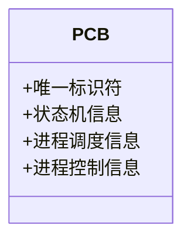
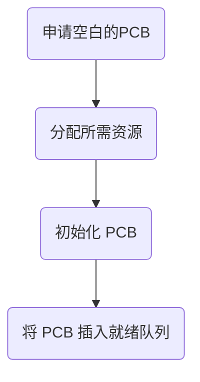
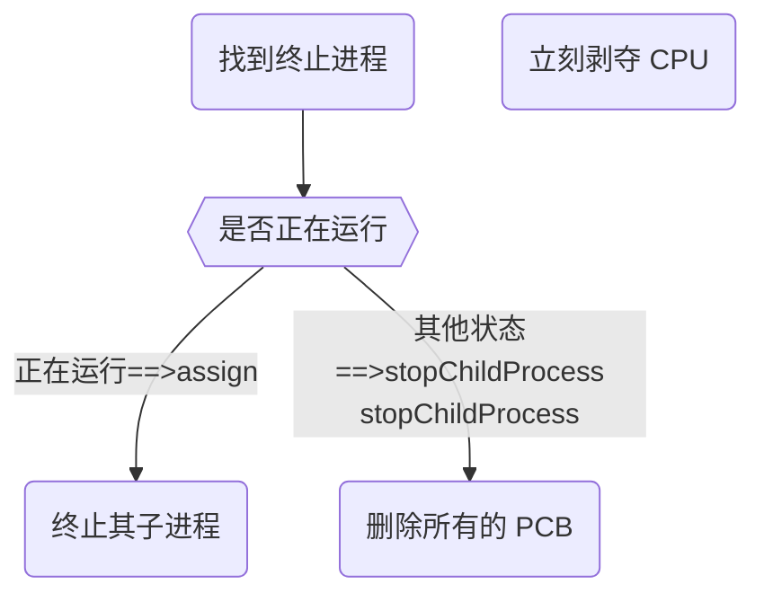
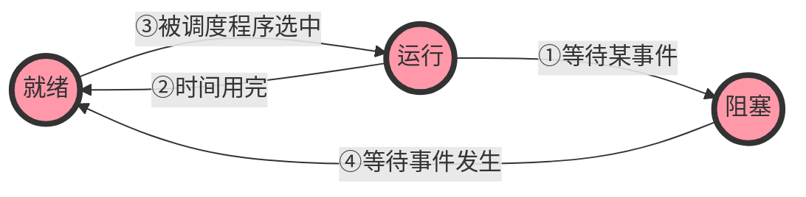
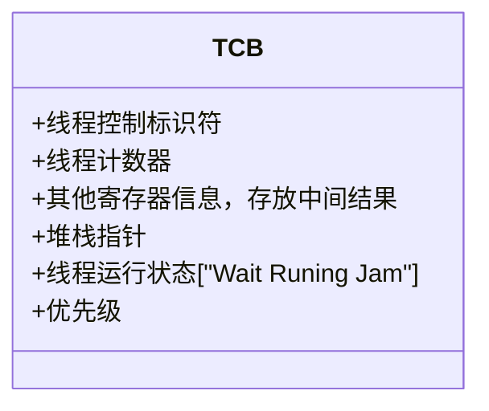

## 进程

> 进程是资源分配的基本单位。
>
> 进程控制块(Process Control Block PCB)描述进程的基本信息和运行状态，所谓的创建进程和撤销进程，都是指对 `PCB` 的操作。

进程控制块包含下列信息：

### 1. 进程标识符（PID）

进程标识符用于唯一地标识一个进程。

一个进程通常由两种标识符组成：

- **内部标识符**

在所有操作系统中，都为每一个进程赋予了一个唯一的数字标识符，它通常是一个进程的序号，设置内部标识符主要是为了方便系统使用。

- **外部标识符**

它由创建者提供，通常是由字母、数字组成，往往是由用户（进程）在访问该进程时使用，为了描述进程的家族关系，还应设置父进程标识及子进程标识。此外，还可以设置用户标识，以标识拥有该进程的用户。

可以参考一个指令

```sh
kill pid 
kill p_name
```

### 2. 处理机状态

处理机状态信息主要由处理机的各种寄存器的内容组成。

包括： `通用寄存器`、`指令计数器`、`程序状态字 PSW`、`用户栈指针`

这些信息显然和进程相关，因此，进程一旦被中断，就必须把这些信息保存在 `PCB` 中，以便在恢复运行时能完全恢复中断前的状态。

### 3. 进程调度信息

在 PCB 中还存放一些进程调度和进程对换相关的信息。

包括：`进程状态`、`进程优先级`、`进程调度所需要的其他信息`（所采用的进程调度算法有关），`事件`（指进程由执行状态变为阻塞态所等待发生的事件，即阻塞原因）

### 4. 进程控制信息

- 程序和数据的地址。

- 进程同步和通信机制，指实现进程同步和进程通信时必须的机制，如消息队列的指针、信号量等，他们可能全部或部分的放在 `PCB`中。
- 资源清单，列出了出 `CPU`以外的、进程所需的全部资源及已经分配到改进程的资源清单。
- 链接指针，他给出了本进程（`PCB`）所在队列的下一个进程的 `PCB` 的首地址。



### 进程的特征

1. **动态性（进程的基本特征）**

    进程是程序的一次执行过程，是动态地产生，变化和消亡

2. **并发性**

    内存中有多个进程实体，各进程可并发执行

3. **独立性**

    进程是**独立运行**，**独立获得资源**，**独立接受调度**的**基本单位**

4. **异步性**

    各进程按各自独立的，不可预知的速度向前推进，操作系统要提供”**进程同步机制**“来解决异步问题

5. **结构性**

    每个进程都会配置一个 **PCB** ，结构上看，进程由程序段，数据段，**PCB** 组成

### 进程态的切换


- 创建态(created): **进程**正在被创建，包括建立空白 **PCB**，由系统为进程分配资源等。

#### 基本状态

- 就绪状态(`ready`): **进程**获得了除了**处理机外的一切资源**，一旦获得了处理及资源就可以立刻开始运行，系统中处于就绪态的进程可以由很多个，通常将他们排成一个队列，称为就绪队列。

- 运行状态(`running`)：**进程**正在处理机上运行。单处理机情况下每一每刻最多只有一个进程处于运行态。

- 阻塞状态(`waiting`): **进程**请求等待某个事件发生，在该事件完成前，即使处理机资源空闲，该进程也不能运行，例如请求了系统调用或者是等待某些资源。

---

- 中止态(**dead**): 进程正在结束。系统先将进程置为结束态，之后再进行资源的释放和回收等工作。

> 需要注意:
>
> - 只有就绪态和运行态可以相互转换,其他的都是单向转换,就绪状态的进程通过调度算法从而获得 `CPU` 事件,转为运行状态;而运行状态的进程,在分配给他的 CPU 时间片用完之后就会转为就绪状态,等待下一次调度。
> - 阻塞状态是缺少需要的资源从而由运行状态转换而来,但是该资源不包括`CPU`时间,缺少`CPU` 时间会从运行态转换为就绪态。
> - 运行态道阻塞态**一般**是**主动**的行为。
> - 阻塞态道就绪态是被动的行为。

### 进程的组织方式

- 链式方式：将同一状态的 **PCB** 连接道同一个队列
- 索引方式：将同一状态的 **PCB** 放在同一个索引表中

### 进程控制

进程控制是用**原语**来实现的：

> tips:
>
> 原语是指执行期间不允许终中断的程序段，是同一个不可分割的基本单位。
>
> 通过”**关中断指令**“和”**开中断指令**“实现了原语的**原子性**

### 进程的创建

#### 创建原语

1. 申请空白 **PCB**
2. 为进程分配所需资源
3. 初始化 **PCB**
4. 将 PCB 插入就绪队列（创建态->就绪态）



#### 引起进程创建的事件

1. 用户登陆
2. 作业调度（有新的作业将要运行）
3. 提供服务
4. 应用请求（用户进程主动请求创建子进程）

#### 进程的终止

##### 撤销原语

1. 从 **PCB** 集合中找到终止进程的 **PCB**
2. 若进程正在运行，立刻剥夺 **CPU**，将 **CPU** 分配给其他进程
3. 中止其所有的子进程
4. 将该进程的所有资源归还给父进程或是操作系统
5. 删除 **PCB**



##### 引起进程终止的事件

- 正常结束

- 异常结束
- 外界干预

#### 进程切换

##### 切换原语

1. 将运行环境信息存入 **PCB**
2. 将 **PCB** 移入相应队列
3. 选择另一个进程执行，并更新其 **PCB**
4. 根据 **PCB** 恢复进程所需的运行环境

###### 引起切换的事件

- 当前进程**时间片**到，该被处理了
- 更高级的进程到达
- 当前进程主动阻塞
- 当前进程中止

### 进程通信

#### 1. 共享存储

- 两个进程对共享空间的访问必须时互斥的（临界资源）

- 操作系统只提供**共享空间**和**同步互斥工具**（P,V操作）

    > 主要有两种方式:
    >
    > - 基于数据结构的共享
    >   - 只能共享固定的数据结构
    >   - 速度慢，是一种低效的共享方式
    > - 基于存储区的共享
    >   - 共享方式和大小由进程自己决定
    >   - 速度快，是一种高级的共享方式

#### 2. 管道通信

- 管道是半双工的，先进先出的，它把一个进程的输出和另一个进程的输入连接在一起

- 一个进程（写进程）在管道的尾部写入数据，另一个进程（读进程）从管道的头部读出数据

- 无名管道用于父子进程之间的通信；有名管道用于运行同一个系统中的任意两个进程间的通信

- 各个进程对管道的访问是互斥的

- 管道没有写满的时候，不能向管道中再写（读）数据

- 从管道中读取数据是一次性的，数据一旦被读取就会从管道中抛弃

- 一次只能由一个**读进程**，但是可以有多个**写进程**

> 无名管道：创建管道——读管道——写管道——关闭管道
>
> 有名管道：创建管道——删除管道——打开管道——关闭管道——读管道——写管道

#### 3. 消息传递

> 进程间的数据交换以格式化消息（message）为单位。
>
> 通过**发送消息/接收消息**两个原语进行

##### 直接通信方式

发送进程直接将消息发送到接受进程的**消息缓冲队列**中

##### 间接通信方式

发送进程将消息发送到某个中间实体，一般为__信箱__，接收端从中间实体接受消息

## 线程

### 基本概念

线程是独立调度的**基本单位**。

一个进程中可以由多个线程，他们共享进程资源。

比如：QQ和浏览器是两个进程，浏览器中里面由很多线程，竟然刚好探讨到了浏览器的线程，值得一提的是单个页面基本有五种线程构成，包含插件线程，网络请求线程，计时器线程，渲染线程，事件触发线程（DomEvent），JS 线程。这里可以知道线程之间是可以共享资源 (HTML)的，但是浏览器的运行与QQ之间是不可通信的，资源是不共享的，QQ又有自己的进程，其下还有自己的线程。

### 特点

#### 调度

线程作为独立调度的基本单位，进程内的线程调度不会引起[进程切换](#process-switch)，开销更小。

#### 并发性

- 同一进程内的线程可以并发运行。
- 不同进程间内的线程可以并发运行。

#### 资源

- 线程几乎不占有资源，而是共享进程资源。

#### 支持多处理机系统

- 可以将多个线程分配给多个处理机运行。

### 线程的实现方式

线程库支持的线程（用户级线程 **User-Level Threed,ULT**）

- 线程的切换由应用程序负责，在用户态下即可完成。
- 线程表存储在用户空间，系统内核意识下到线程的存在。
- 调度：
  - 操作系统为进程分配时间片。
  - 用户的调度程序再将时间片分给线程。
- 优点
  - 线程的切换在用户态即可完成，**开销小**，**效率高**。
- 缺点
  - 当**一个线程阻塞**后，其他线程**都会被阻塞**，并发度不高。

### 多线程模式

#### 一对一模式

一个用户级线程映射一个内核级线程（一个 **UTL** 一个 **TCB**(**Thread Control Block**))

##### 优点

- 并发能力强

##### 缺点

- 开销大

#### 多对一模式

将多个用户级线程映射到一个内核级线程，等同于用户级线程（多个 **UTL** 一个 **TCB**）

##### 优点

- 效率高

#### 缺点

- 并发能力弱，多个线程不能并行的运行在多个处理机上

#### 多对多模式

将 n 个 ULT 映射到  m 个内核级线程（ m <= n）

### 线程的控制

#### 线程的切换



#### 线程的组织与控制

将 TCB 组织成线程表进行管理



## 总结

- 资源

进程是资源分配的基本单位，但是线程不拥有资源，线程可以访问所属进程的资源

- 调度

线程是独立调度的基本单位，在同一个进程中，线程的切换不会引起进程切换，从一个进程中的线程切换到另一个进程中的线程时，会引起进程切换

- 系统开销

由于创建或撤销进程时,系统都要为之分配或回收资源，如内存空间，I/O 设备等，所付出的开销远大于创建或撤销线程时的开销。在进行进程切换时，涉及当前执行进程 `CPU` 环境的保存及新调度进 `CPU` 环境的设置，而线程切换时只需要设置和保存少量的少量的寄存器内容，故开销也很小。

- 通信方面

线程间可以通过直接读写同一进程中的数据进行通信，但是进程通信需要借助 `PIC`。
