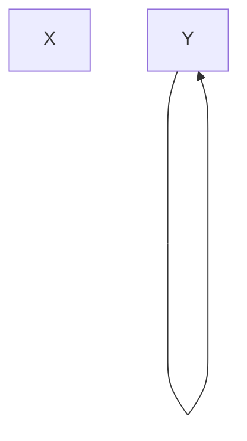

# 规范化

## 函数依赖

**定义**:  设 `R(U)`是属性集 `U`上的关系模式， `X`，`Y`是 `U`的子集。若对于`R(U)`的任意一个可能的关系 `r`, `r`中不可能存在两个元组 在 `X`上的属性值相等，而在 `Y`上的属性值不等，则称 `X`函数确定 `Y`或 `Y`函数依赖于 `X` .

> 举个例子:
>
> R( [`学号`,`学生`])，U = [`学号`,`学生`]
>
> 对于一个关系 `学号->学生`中，所对应到的关系模式为`1-1`(关系模式指的是 一对一，一对多，多对多 这种) ：
>
> [A, 小明]
>
> [B ,小润]
>
> ….
>
> 这几个元组之间一旦学号确定了，那么对应到的学生就确定了，也就是说 学生函数依赖于学号，学号函数确定学生。

### 非平凡函数依赖

X->Y ,但是 X  并不包含 Y ,也就是 X 中的子集并不包含 Y

### 平凡函数依赖

不是非平凡依赖就是平凡依赖，也就是 X->Y ，但是 X 包含了 Y，对于任意关系模式，平凡函数依赖都是必然成立的，因为 X->X是可以保证的

> 平凡函数依赖的作用主要是讨论，同一类实体的不同操作顺序之类的情况

### 完全函数依赖

在 `R(U)`中，如果 X->Y ，对于 X 的任意一个真子集 X\`,都有 X\`不函数确定 Y，而是 X 中除了 X\` 的部分函数确定其他部分的数据

> 完全函数依赖实际上就是有点类似于数学中的奇函数的图像，也就是 x 一一对应 y

### 部分函数依赖

在 `R(U)` 中，如果 X->Y，对于 X 的一个真子集 $X^{'}$，就使得 $X^{'}->Y$ 成立。

> 可以举一个特殊的例子，比如高数中的 $f(x) = f(-x)$，只需要 x 的正半轴部分就能表示 y 的所有取值了。

### 传递函数依赖

在 `R(U)` 中，如果 $X->Y(Y \subsetneq X)$，$Y {\nrightarrow}X,Y\rightarrow Z,Z\subsetneq Y$，则 称 `Z` 对 `X` 传递依赖

> 这里如果加上条件$Y \subsetneq X $,是因为如果 $X\rightarrow Y,则 X \leftarrow \rightarrow Y ,实际上就是 X == Y, 也就直接就是 X \rightarrow Z$，其实可以联系一下高数中的求极限时对于 复合函数传递的要求，也是不能直接取值的原因。需要保证描述的完整性。
