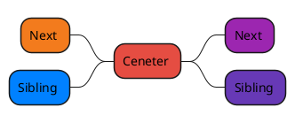

思维导图

```plantuml
@startmindmap
<style>
mindmapDiagram {
	.red {BackgroundColor #e54d42;};
	.orange {BackgroundColor #f37b1d;};
	.yellow {BackgroundColor #fbbd08;};
	.olive {BackgroundColor #8dc63f;};
	.green {BackgroundColor #39b54a;};
	.cyan {BackgroundColor #1cbbb4;};
	.blue {BackgroundColor #0081ff;};
	.purple {BackgroundColor #6739b6;};
	.mauve {BackgroundColor #9c26b0;};
	.pink {BackgroundColor #e03997;};
	.brown {BackgroundColor #a5673f;};
	.grey {BackgroundColor #8799a3;};
	.black {BackgroundColor #333333;};
	.darkGray {BackgroundColor #666666;};
	.gray {BackgroundColor #aaaaaa;};
	.ghostWhite {BackgroundColor #f1f1f1;};
	.white {BackgroundColor #ffffff;};
	.redLight{BackgroundColor #fadbd9;};
	.orangeLight{BackgroundColor #fde6d2;};
	.yellowLight{BackgroundColor #fef2ce;};
	.oliveLight{BackgroundColor #e8f4d9;};
	.greenLight{BackgroundColor #d7f0db;};
	.cyanLight{BackgroundColor #d2f1f0;};
	.blueLight{BackgroundColor #cce6ff;};
	.purpleLight{BackgroundColor #e1d7f0;};
	.mauveLight{BackgroundColor #ebd4ef;};
	.pinkLight{BackgroundColor #f9d7ea;};
	.brownLight{BackgroundColor #ede1d9;};
	.greyLight{BackgroundColor #e7ebed;};
}
</style>

* Ceneter <<red>>
left side
** Next <<orange>>
** Sibling <<blue>>
right side
** Next <<mauve>>
** Sibling <<purple>>
@endmindmap
```
