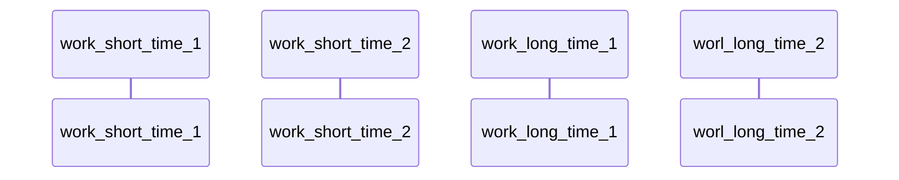
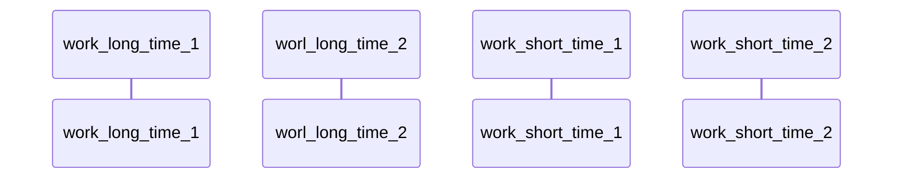
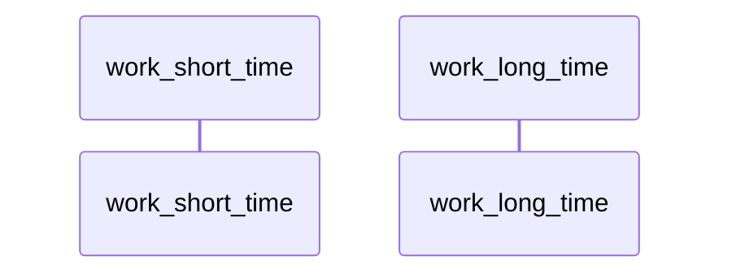
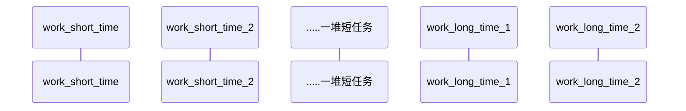
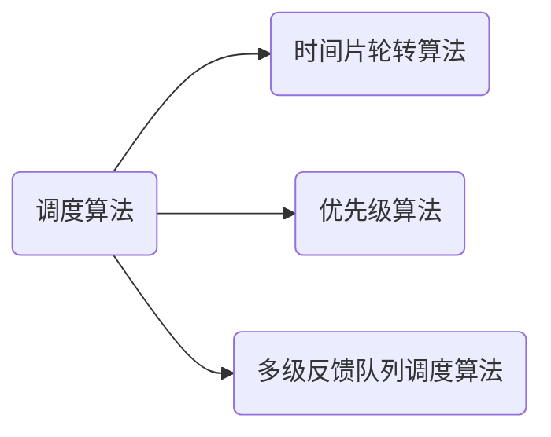
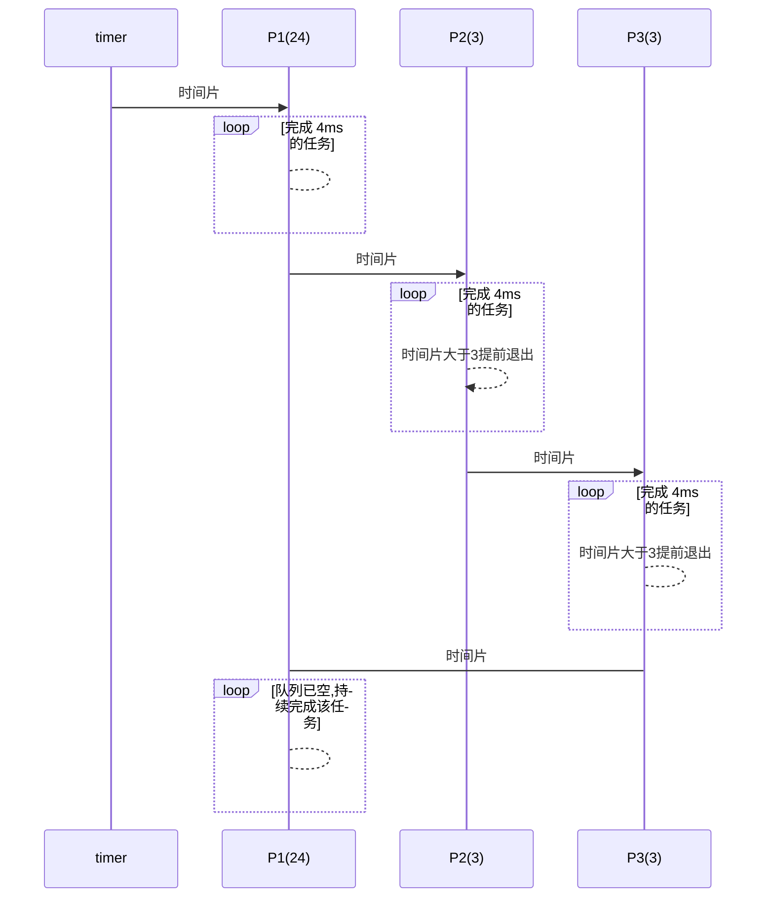

title: 操作系统知识点总结-进程调度算法
tags:
  - 基础知识
  - 操作系统
  - 进程管理
  - 调度算法
categories:
  - os
mathjax: true
abbrlink: 4fd8d774
nanoid: fV1zB4JrvBGsQOdrDDpRP
date: 2022-09-09 12:42:33
---

# 进程调度算法

不同环境的调度算法目标不同,因此需要针对不同环境来讨论调度算法.

## 调度的概念

> 在处理机调度是对处理机进行分配，即从就绪队列中按照一定的算法选择一个进程并将处理机给它运行，以实现进程并发地运行。

这样说起来可能有点绕，其实就是 CPU 这些处理器，按照一定策略执行某个进程。

处理机调度是多道程序操作系统的基础，是操作系统设计的核心问题。

## 调度的层次

### 作业调度（高级调度）

> 按照一定原则从外存上处于后备（待开始）队列的作业选择一个或多个作业，给予必要的资源，并建立相应的**进程块**（**PCB**）,以使他获得竞争处理及资源的权力。

作业调度是外存和内存之间的调度，每个作业只调用一次，调出一次，作业调度时建立。

也就是进程的创建过程。

### 内存调度（中级调度）

> 可以将暂时不能运行的进程调至外存等待，这些进程会进入“**挂起**”状态，其 **PCB** 仍然常驻在内存，将放入到挂起队列中，其目的是提高内存利用率和系统吞吐量。

通过中级调度来决定哪个处于挂起状态的进程重新调入内存中。

### 进程调度（低级调度）

> 按照某种方法和策略从就绪队列中选择一个进程，将处理及分配。

进程调度是操作系统**最基本的一种调度，其频率很高**，一般几十毫秒（一个时间片

| 调度类型             | 调度位置                | 进程状态变化                       |
| -------------------- | ----------------------- | ---------------------------------- |
| 作业调度（高级调度） | 外存-->内存（面向作业） | 无-->创建态-->就绪态               |
| 内存调度（中级调度） | 外存-->内存（面向进程） | 挂起-->就绪态（阻塞挂起-->阻塞态） |
| 进程调度（低级调度） | 内存-->CPU              | 就绪态-->挂起态                    |

## 	批处理系统

批处理系统没有太多的用户操作,该系统中,调度算法目标是保证吞吐量和周转时间(从提交到终止的时间).

### 1.1 先来先服务(first-come-fist-serverd FCFS)

非抢占式的调度算法,按照顺序进行调度.

有利于长作业,但不利于短作业,因为短作业必须一直等待前面的长作业执行完毕才能执行,而长作业又需要执行很长的时间,造成了短作业等待的时间过长.

最优状态,耗时短的作业先被执行:

最不利状态,耗时的作业一直占用 `CPU`,使得最短作业始终无法完成:

### 1.2 短作业优先(shortest-job-fist SJF)

非抢占式的掉段算法,按估计运行时间最短的顺序进行调度.

长作业有可能会饿死,处于一直等待短作业执行完毕的状态.因为如果一直有短作业到来,那么长作业永远得不到调度.

比较优的状态,耗时短的任务总量少于长任务,这样让作业更多的占比完成:

不利状态,耗时短的任务总量远大于长任务,那么这样饿死的就是相对较短的长任务了🎃:

### 1.3 最短剩余时间优先(shortest remaining time time next SRTN)

最短作业优先的抢占式版本,按剩余运行时间的顺序调度,当一个新作也到达时,其整个运行时间与当前进程的剩余时间作比较,如果新的进程需要的时间更少,则挂起当前进程,运行新的进程,否则新的进程等待.

## 2.交互式系统

> 交互式系统又大量的用户交互操作,在该系统中调度算法的目标是快速地进行响应.

## 调度算法

### 2.1 时间片轮转

> 将所有的就绪进程按照[FCFS](#FCFS) 的原则排成一个队列,每次调度时,把`CPU`时间分配给对首进程,该进程可以执行一个时间片.当时间片用完时,由计时器发出时钟中断,调度程序便停止该进程的执行,并将它送往就绪队列的末尾,同时继续把CPU时间分配给队列的末尾,同时继续把CPU时间分配给队首的进程.
>
> 时间片轮转算法的效率和时间片的大小很有关系:
>
> - 因为进程切换都要保存进程的信息并且载入新进程的信息,若时间片太小,会导致进程切换得太频繁,在进程切换上就会花很多时间.
> - 而如果时间片过长,那么实时性就不能得到保证

该算法中,将一个较小时间单元定义为时间量或时间片,时间片得大小通常为 **10-100ms** .就绪队列作为循环队列,`CPU` 调度程序循环真个就绪队列,为每个进程分配不超过一个时间片的 `CPU`.

为了实现 RR 调度,先将就绪队列视为进程的 `FIFO` 队列,新进程添加到就绪对列的尾部,`CPU` 调度程序从就绪对列中选择第一个进程,将定时器设置在一个时间片后中断,最后分派这个进程.

之后将可能出现两种情况..经常可能只需要少于时间片的 `CPU` 的任务执行.对于这种情况,进程本身会自动释放 `CPU`,调度程序将接着处理就绪对列的下一个进程.否则,如果当前运行进程的 `CPU`执行大于一个时间片,那么定时器肯定会中断(超时),进而中断操作系统.然后,进行上下文切换,再将进程加到就绪对列的尾部,接着 `CPU` 调度程序会选择就绪队列的下一个进程.

> 前面提到过,一个进程块保留有进程信息,在中断之后,可以用来恢复上下文环境.

不过,采用 RR 策略的平均等待时间通常较长,如果有如下状况的几组任务,他们在时间 0 到达.

| 进程 | 执行时间 |
| ---- | -------- |
| P~1~ | 24       |
| P~2~ | 3        |
| P~3~ | 3        |

如果使用 **4ms** 的(CPU)时间片,那么 `Task_A` 会执行最初的 `4ms`,由于它还需要 `20ms`,所以在第一个时间片之后,他会被抢占,而 `CPU` 就交给对列中的下一个进程(P~2~),由于 P~2~ 不需要一个时间片,所以其他时间片用完之前就会退出.`CPU` 又交给了进程 P~1~ 以便继续执行

计算这个调度的平均等待时间,P~1~等待了 $$10-4(从第4ms就开始等待) = 6 ms$$,P~2~等待了 **4ms** ,而 P~3~ 等待了 **7ms** ,因此平均等待时间为 $$ 17/3 \approx 5.66ms$$ .

在 RR 调度算法中,没有进程被连续分配超过一个时间片的 CPU(除非他是对列中唯一可运行的进程).如果进程的 `CPU` 执行进程超过一个时间片,那么该进程会被抢占,并被放回到就绪对列,因此,RR 调度算法是抢占的.

### 2.2 优先级调度

为每一个进程,按优先级进行调度.

为了防止低优先级永远等不到调度,可以随着时间的推移增加等待进程的优先级.

对于优先级调度,进一步可以被划分为非抢占式优先级调度算法和抢占式优先级.

### 2.3 多级反馈队列

一个进程需要 100 个时间片,如果采用`RR` ,那么需要交换 100 次.

多级队列是为这种需要连续执行多个时间片的进程考虑的,它设置了多个队列,每个队列时间片大小都不同,列如 1,2,4,8,..…进程在第一个队列没执行完,就会被移到下一个队列.这种方式下,之前的进程只需要交换 7 次.

每个队列的优先权也不同,最上面的优先权最高.因此只有上一个队列没有进程在排队,才能调度当前队列上的进程.

可以将这种算法看作是 `RR `和优先级调度算法的结合.

对于优先级最低的队列来说,里面遵循的是 `RR` .也就是说,位于队列中有  M 个作业,他们的运行时间是通过队列所设定的时间片来确定的;对于其他队列,遵循的是`FIFS`,每一个进程分配一定的时间片,若时间片进程未结束,则进入下一优先级队列的末尾.

各个队列的时间片是随着优先级的增加而减少的,也就是说,优先级越高的队列中他的时间片越短,同时,为了便于那些超大作业的完成,最后一个队列的时间片一般不大

## 上下文及切换地址

> 标红部分 是进程/线程切换时需要恢复的上下文

进程切换导致的地址空间代价巨大：

- 保存/恢复页表寄存器

- `TLB `全部失效

- `Cache `全部失效，有可能需要 `Cache `回写恢复
- 新进程运行初期可能缺页不高，需要 `I/O` 操作