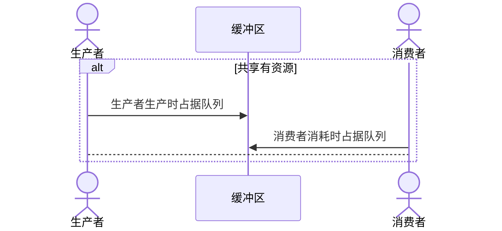

typora-root-url: ./os-process-sync-quiz
title: 操作系统知识点总结-进程同步问题
mathjax: true
tags:
  - 基础知识
  - 操作系统
  - 进程管理
  - 进程同步
  - 经典问题
categories:
  - os
abbrlink: e5d70896
nanoid: SgDUdaIfPFLvt1fase5oF
date: 2022-09-13 16:29:03
sticky:
---

# 进程管理(经典问题)

## 生产者-消费问题

- 系统中有一组生产者进程和一组消费者，生产者进程每次生产一个产品放入缓冲区，消费者进程每次生产一个产品放入缓冲区，消费者进程每次从缓冲区中取出一个产品并使用；

- 生产者、消费者共享一个初始为空，大小为 n 的缓冲区；

- 只有缓冲区**没满时**，生产者才能把产品**放入**缓冲区，否则必须等待；
- 只有缓冲区**不空时**，消费者才能从中取出产品，否则必须等待；
- 缓冲区是临界资源，各进程必须**互斥**访问。

### 分析关系


- 生产者和消费者访问缓冲区是互斥的。

- 生产者和消费者的工作需要同步，即生产完之后才能消费。

### 设置信号量

```cpp
semaphore mutex = 1;
semaphore empty = n;
semaphore full  = 0;
```

### 代码实现

```cpp
void producer(){
	while (1) {
        P(empty);
        P(mutex);
        // 存入缓冲区
        V(mutex);
        V(full);// 唤起消费者
    }    
}
void consumer(){
    while (1) {
        P(full);
        P(mutex);
        // 使用资源
        V(mutex);
		V(empty);        
    }    
    
}

```

> 其实实现思路很简单，无非就是**同步互斥**关系



为什么要互斥呢，因为缓冲区的本身就是一个共享资源，所以，也可以这样去理解。

```cpp
semaphore buffer_full = 0;
semaphore buffer = 1; // 表示 缓冲区 只有一个
semaphore buffer_empty = n; // 注意buffer_full + buffer_empty = n; 这表示了容量

void producer(){
    while (1) {
        P(buffer_empty); // 等待空位
        P(buffer); // 申请使用 buffer
        // 使用空位
        V(buffer); // 这里应该先退出，这样 consumer 才不会因为检测到满了，然后争夺 buffer 却拿不到权限进去，应该让他先进去，因为满足的是不满就可以进。
        V(buffer_full); // 更新满的状态，或者说元素的数目
    }
}
void consumer(){
    while (1) {
        P(buffer_full);
        P(buffer);
        // 消费资源
        V(buffer);
        V(buffer_empty);
    }
}
```

> :ice_cream: 能否用前驱关系理解呢？

## 多生产者-多消费者问题

有父亲、母亲、儿子、女儿四人，其中：

- 父亲往盘子中放苹果；
- 母亲往盘子中放橘子；
- 女儿从盘子中拿苹果；
- 儿子从盘子中拿橘子；
- 只有盘子空时才能放水果；
- 只有有需要的水果时才能拿水果。

### 关系分析

#### 互斥关系

父亲和母亲使用同一个盘子

#### 同步关系

父亲放完苹果之后，女儿才能拿到苹果

母亲放入橘子之后，儿子才能拿到橘子

盘子为空才能放水果（大抵是只有一个空位吧）


### 信号量设置


```cpp
semaphore mutex = 1;// 盘子的互斥关系
semaphore plate = 1;// 盘子的剩余空位
semaphore apple = 0;
semaphore orange= 0;
```

### 程序实现

```cpp
void dad(){
    P(plate); // 申请盘子
    P(mutex); // 占有盘子（进入临界区
    /** 🍎放苹果 **/
	V(mutex); // 不占据盘子
    V(apple); // 更新苹果
    // 这里 爸爸 并没有说放了就吃了，所以 盘子的空位为 1，就没有消耗
}
void mom(){
    P(plate); // 申请盘子
    P(mutex); // 占有盘子（进入临界区
    /** 🍊放橘子 **/
	V(mutex); // 不占据盘子
    V(orange); // 更新苹果
    // 这里 妈妈 也并没有说放了就吃了，所以 盘子的空位为 1，就没有消耗
}
void daughter (){
    P(apple); // 申请拿一个苹果
    P(mutex); // 要等待其他的放了（进入临界区
    /** 👩吃🍎 **/
	V(mutex); // 
    V(apple);
}
void son (){
    P(orange); // 申请拿一个苹果
    P(mutex); // 要等待其他的放了（进入临界区
    /** 👦吃🍊 **/
	V(mutex); // 
    V(orange);
}
```

> 由于本问题缓冲区为1，可以考虑不设置信号量。

## 烟鬼问题(一个生产者-多消费者)

系统中有一个供应者和三个吸烟者，吸烟者吸烟需要自己卷烟，其中

- 卷烟需要烟草、纸、胶水三种材料
- 每个吸烟者各有其中的一种材料
- 供应者每次会提供其中两种材料，并由缺少该材料的吸烟者拿取
- 吸烟者制作完烟并抽掉后，发出信号，供应者放下一组物品

### 分析关系

供应者：提供两种材料

- 组合一：烟草 + 纸
- 组合二：烟草 + 胶水
- 组合三：胶水 + 纸 

烟鬼：需要两种类型，也就是供应者每次提供只够一个人使用

#### 互斥关系：

- 烟鬼之间互斥

#### 同步关系

- 供应者提供的组合顺序

### 信号量设置

```cpp
semaphore cigratteAndPaper  = 0; // 草纸组合
semaphore cigratteAndGlue   = 0; // 草胶组合
semaphore glueAndPaper  	= 0; // 胶纸组合
semaphore finish            = 0; // 抽烟状态
int turn = 0; // 用于标记是几轮
```

### 代码实现

```cpp
void producer() {
    while (1) {
 		if (turn == 0) {
            V(cigratteAndPaper);
            continue;
        }
 		if (turn == 1) {
            V(cigratteAndGlue);
            continue;
        }
 		if (turn == 2) {
            V(glueAndPaper);
            continue;
        }
        i = (i+1) % 3;
        P(finish);
    }
}

void cigratteAndPaperConsumer (){
    while(1){
        P(cigratteAndPaper);
        V(finish);
    }
}
void cigratteAndGlueConsumer  (){
    while(1) {
	    P(cigratteAndGlue);
        V(finish);
    }
}
void glueAndPaperConsumer     (){
     while(1){
        P(glueAndPaper);
        V(finish);
    }
}
```

## 读者-写者 问题

有读者和写者两组并发进程，共享一个文件。要求：

- 读者可以同时读取文件；
- 同一时间只能有一个写者进行写操作；
- 任一写着完成写操作之前不允许其他进程进行读或写操作；
- 写者执行写操作前，应让其他读者和写者全部退出。

### 关系分析

#### 互斥关系

- 写进程和写进程之间

- 写进程和读进程之间

### 信号量设置

```cpp
semaphore rw = 1;
semaphore ww = 1;
int count = 0;
semaphore mutex = 1;
```

### 程序实现

```cpp
void writer (){
    while (1) {
        P(ww);
        P(rw);
        // 写作
        V(rw);
        V(ww);
    }
}
void reader (){
    while (1) {
        P(ww);
        P(mutex);
        if (count == 0) {
            P(rw);
        }
        V(mutex);
        V(ww);
        
        // 读文件
       	P(mutex);
        if (--count == 0) {
            V(rw);
        }
        V(mutex);
    }   
}
```

## 哲学家进餐问题

在一个桌子上，有5位哲学家，其中

- 每位哲学家之间摆着一**根**筷子，共计5根
- 哲学家平时在思考人生，饿了就会尝试拿起左右手的筷子（一根一根的拿）
- 如果筷子在别人手上，则等待
- 拿起了两根筷子时，哲学家开始进食
- 用餐完毕后放下筷子继续思考

### 关系分析

鉴于这个和之前的不一样，所以阐明一下我的思考过程：

- 什么是共享资源？

    筷子？不不不，不止，我们假定一个人饿了，那么他周围的两个人都拿不到，因为他们周边只有一个筷子了，但是对于对角线的位置的人却还是可以拿到的，而且是二者之一，

    也就是说相邻的三人之间的关系是互斥，但是对于其他人是同步的，也就是说相邻的人之间的筷子才是共享资源。

- 信号量怎样设置？

    其实信号量有点类似资源状态机，那么我们应该表示的是被使用的筷子会更加方便，其实筷子对应哲学家的数量，所以也不是特别大的影响

### 信号量设置

```cpp
semaphore chopstick[5] = {1,1,1,1,1}; //代表五根筷子的资源
semaphore mutex = 1;  //对左右筷子整体资源互斥访问
```

### 实际代码

```cpp
void Philosophy_i(int i){ // 假设这里有 i 个不同的进程，这是第 i 个，因为每个人考虑的情况都一样，都是消费者
    while (1) {
        P(mutex); // 进入临界区，也就是要开始拿共享资源了
        P(chopstick[i]); // 
        P(chopstick[ (i+1) % 5 ]);
        V(mutex);
        // 筷子拿到了，干饭
        // 干完了
        V(chopstick[i]);
        V(chopstick[(i+1)%5]);
		// 继续思考        
    }
}
```
