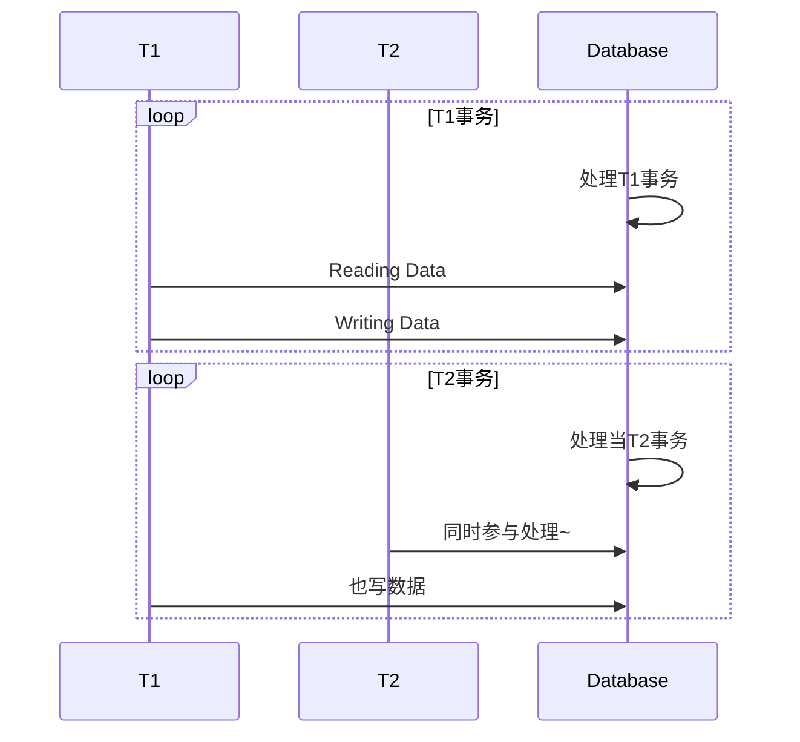

title: 并发控制
tag:
  - 数据库系统概论
dg-publish: true
categories:
  - 技术学习
nanoid: '-04eNl7fBquaV9oeFjPXN'
date created: 2023-03-23 00:00:00
date modified: 2023-03-26 00:00:00
---

## 基本名词

- 多用户数据库系统
	- 允许多个用户同时使用的数据库
- 多事务执行方式
	- 事务串行执行（某一时刻只能有一个事务运行）
		- 不能充分利用系统资源，发挥数据库共享资源的特点
	- 交叉并发方式
		- 在单处理机中，事务的并行执行是这些并行事务的并行操作轮流进行
		- 在单处理中的并行事务并没有真正地并行运行，但能够减少处理机地空闲时间
	- 同时并发方式
		- 在多处理机中，每个处理机可以运行一个事务，多个处理机可以同时运行多个事务。
		- 最理想地并发方式

## 事务并发带来的问题

- 多个事务同时运行，可能会导致数据存取异常，破坏事务隔离性和数据库的[[专有名词库#一致性|一致性(Consistency)]]

> [!TIP] 并发控制的重要性💡  
>数据库系统必须提供并发控制机制。  
> 并发控制是衡量一个数据库管理系统的重要标志之一。  

## 并发操作带来的数据不一致性

1. 丢失修改
2. 不可重复读 (Non-Reading)（幻读）
3. 读”脏“数据（Dirty Read）

### 丢失修改：

`T1`、`T2` 同时读入一个数据并进行修改，`T2` 的提交结果破坏了 `T1` 的提交结果。

### 不可重复读（前后多次读取，数据内容不一致）

T1 事务在某一个时刻进行读，T2 紧接着开始写，然后 T1 还没有结束，又去读数据，读到数据为 T2 修改之后的，出现前后读取数据不一致。

### 幻读 repeatable read（前后多次读取，数据总量不一致）：

T1 事务在某一个时刻进行读数据库的内容，T2 紧接着开始添加数据或者删除数据，然后 T1 还没有结束，又去读数据库，发现数据库的总内容，增加或者减少了。

> [!TIP] 幻读 和 不可重复读的区别💡  
> 1. 幻读强调的是表级  
> 2. 不可重复读强调的是行级锁

## 脏读 dirty read（读到未提交的数据）

`T1` 事务在某一个时刻进行写（`X`）操作，`T2` 紧接着开始读，然后 `T1` 崩了或者特殊原因，导致回滚，这条数据压根没进入数据库，于是 `T1` 读到了数据库之外的东西。

> [!TIP] 丢失修改、 脏读 和 不可重复读（或幻读）的区别💡
> 1. 丢失修改强调的是写入的问题，每一个事务都是成功的，也就是同时写的问题。
> 2. 脏读强调的是事务回滚失败，一条没有成功的事务，也就是先写后读带来的问题。
> 3. 不可重复读强调的是读的问题，都是成功写入的数据，也就是先读后写带来的问题。
> 4. 本质上，我们碰到情况通过 X(写) S(读) 进行组合，同时读不会出现问题，这也是后面的读锁（共享锁）。

## 并发控制的主要技术

### 封锁（Locking）

基本规则：加锁后事务 T 就对该数据对象有了一定的控制，在事务 T 释放它的锁之前，其他的事务不能更新此数据对象。

> [!INFO] 锁机制  
> 封锁是实现并发控制的一个非常重要的技术

#### 基本封锁类型：  

- 排他锁（Exclusive Lock）简称为 X 锁
	- 事务对数据对象 A 加上锁，则只允许 T 读取和修改 A ，其他任何事务都不能再对 A 加任何锁，直到 T 释放。
	- 用于保证其他事务 T 释放 A 上的锁之前不能再读取和修改 A
- 共享锁 （Share Lock）简称为 S 锁

### 时间戳（Timestamp）

### 乐观控制法

### 多版本控制法（MVVC)
