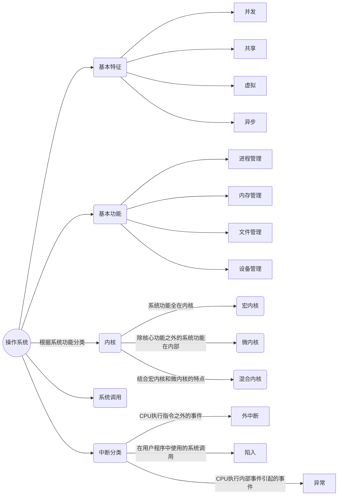
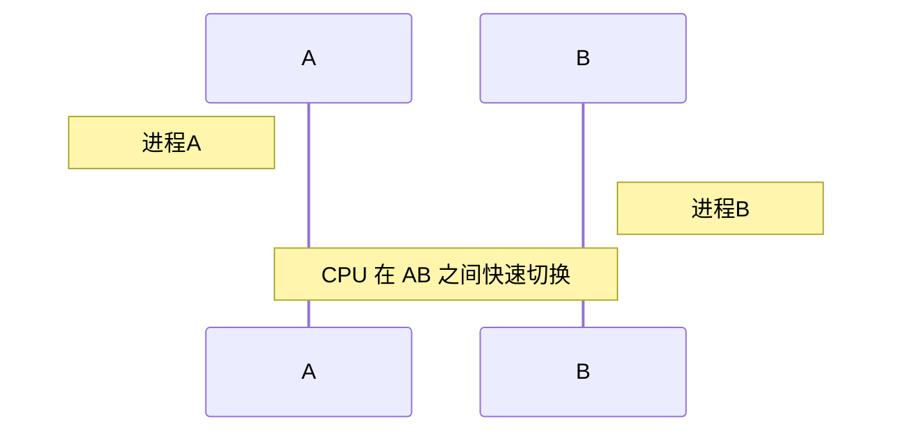
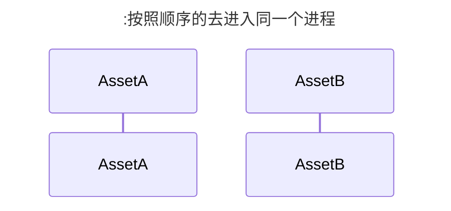

操作系统个人认为更像是竞争问题，对于 CPU 的算力分配，和进程之间的分配问题，既要高效，又要健壮稳定。



## 操作系统的基本定义

> 操作系统(Operating System,OS) 是指控制和管理整个计算机系统的硬件和软件资源,并合理地组织调度计算机和资源分配;提供给**用户和其他软件方便的接口和环境**;它是计算机系统中最基本的**系统软件**.

### 操作系统的角色

- 操作系统是系统资源的**管理者**
- 操作系统**向上提供**方便易用的服务
- 操作系统是**最接近硬件**的一层**软件**

## 基础特征

### 1. 并发

> 并发是指宏观上在一段时间内能同时运行多个程序，而并行则是指同一时刻能运行多个指令。
>
> 并行需要硬件支持，如多流水线，多核处理器或者分布式计算系统。
>
> 操作系统通过引入进程和线程，使得程序能够并发运行。

并发运行并不是真真的同时完成多个任务，而是 `CPU` 的高速处理，使得各个任务之间来回进行，完成各个任务，而并行也就是我们实际业务希望解决的问题，但是对应带来的成本问题也就出现了。
<!--TODO: 处理 Hexo 时序图问题--->



### 2. 共享

> 共享是指系统中的资源可以被多个并发进程共同使用。
>
> 主要有两种共享方式：**互斥共享**和**同时共享**。
>
> 互斥共享的资源被称为临界资源，特点是同时只能有一个占用，比如对于打印机这种外接设备，在同时只能允许一个进程访问，需要用同步机制实现互斥访问，有点类似队列结构（FIFO）。



### 3. 虚拟

> 虚拟技术把一个物理实体转换为多个逻辑实体。
>
> 主要有两种虚拟技术：时（时分复用技术）、空（空分复用技术）。
>
> 多个进程能在同一个处理器上并发执行也就利用了时分复用技术，让每一个进程轮流占用处理器，每次只执行一小个时间片，并快速切换。
>
> 虚拟内存则是使用了空分复用技术，他将物理内存抽象为地址空间，每一个进程都有各自的地址空间，地址空间的也被映射到物理内存，地址空间的页并不需要全部在物理内存中，当使用到一个没有物理内存的页时，执行页面置换算法，将该页置换到内存中。
>
> 虚拟内存的关键问题：主要有调度问题、地址映射问题、替换问题、更新问题（要确保主存与辅存的一致性）

个人认为，虚拟的好处在于可控，让每一步操作是出于可被控制可被调度的，也就使得可优化，更加稳定。

### 4. 异步

> 异步进程不是一次性排队完成，而是走走停停，每一步耗费的时间是不可知的

异步和同步各自有不同的应用场景，不只是在操作系统上的概念，在各大编程语言上也有不同的信息。

## 基本功能

### 1. 进程管理

> **进程控制**，**进程同步**，**进程通信**，**死锁处理**，**处理机调度**等；

1. 进程控制的主要功能是对系统中所有进程实施有效的管理，它具有创建新进程（**fork**），撤销已有进程，实现进程状态转换的功能；

2. 进程同步，也就是异步环境下的一组并发进程因直接制约而互相发送消息，进行互相合作，互相等待，使得各个进程按一定的速度执行的过程，成为进程间的同步，具有同步关系的一组并发进程称为合作进程，合作进程互相发送的信号成为消息或事件，对这样的消息或者事件给一个名称，则我们可用 wait(消息名)表示经常等待合作进程发来的消息，而用过程 signal(消息名)表示像合作进程发送消息。

   进程同时处理同一串数据，会造成不确定性，有多个进程同时对一个文件进行读写，那么读文件的进程无法确定督导的数据是它本来想要的数据（老数据），还是被修改的数据（新数据 `modified data`），除此之外，当先读后写的时候，由于缓冲区没有写入数据，读进程无数据可读，就进入了阻塞态。

   这种两个或多个进程读写某些共享数据，而最后的结果却决于进行的精准时序，称为数据竞争，而这种多个程序可以并发执行，但是由于系统资源有限，程序的执行不是一贯到底的，而是以不可预知的速度推进的，这也就是之前说的**异步性**。

   这种受到访问顺序限制的的数据是没有意义的（对于程序运行不能有二义性，也就是某一个状态是确定的），所以为了能够使得进程有一定的顺序来访问数据，从而引入了同步的概念。

   对于资源是如此，对于数据库操作同样也是如此。

   而之前所说的信号，下述便是对于用信号量实现进程同步的步骤，主要分为 PV 两大操作。

   **信号量**的作用就是控制多进程共享资源的访问（资源有限并且不共享），其本质是任一时刻只能有一个进程访问临界区（代码）数据更新的代码。

#### PV操作

   PV操作即是针对信号量进行的相应操作，PV操作由P操作原语和V操作原语组成（原语是不可中断的过程）。

#### P 操作

   当进程执行P操作，若信号量大于零（有共享资源），则信号量减一，进程继续执行；若信号量为零，则进程等待。

    ```mermaid
    graph TB
        start(P 操作)-->isSingleN{信号量}
        isSingleN---大于0--> down(信号量减一)
        isSingleN---等于0--> wait(等待)
    ```

#### V 操作

   当进程执行 V 操作 ，若信号量大于零（有共享资源），则信号量加一；若信号量为零，则唤醒等待进程。

    ```mermaid
    graph TB
        start(V 操作)-->isSingleN{信号量}
        isSingleN---大于0--> down(信号量减一)
        isSingleN---等于0--> wait(等待)
    ```

### 2. 内存管理

> **内存分配**，**地址映射**，**内存保护与共享**，**虚拟内存**等

内存的管理分为文件内存，和运行内存，对于进程管理比较重要的就是运存的管理了。


### 3. 文件管理

> 文件存储空间的管理、目录管理、文件读写管理和保护等

### 4. 设备管理

> 完成用户的 I/O 请求。为方便用户使用各种设备。并提高设备的利用率。
>
> 主要包括缓冲管理、设备分配、设备处理、虚拟设备等

这是对外的扩展。比如一些键盘。鼠标的信号输入处理。除此之外。网络 I/O 。需要注意的是，文件 I/O 和这种I/O 是由区别的，文件 I/O，更多的偏向于软件层面，


> 我们日常讨论的网络通信本质上就是网络I/O，通过网络I/O，我们可以和远程设备进行通信（数据交换）。由于网络I/O和正常的磁盘I/O在性能和访问方式上有较大的差异，所以针对磁盘I/O的读写方法也就无法适用于网络I/O身上，大部分操作系统针对网络I/O抽象除了一套特殊的接口—— **网络Socket接口** ，用于对网络I/O进行操作。当然，上面也说了，在Linux当中“一切皆文件”，为了统一概念，Socket在Linux当中也是通过文件描述符来进行描述的，只不过这个文件描述符描述的不是本地文件，而是远程设备对应的文件。
> 作者：Brucebat
> 链接：<https://juejin.cn/post/7022249649511596063>
> 来源：稀土掘金
> 著作权归作者所有。商业转载请联系作者获得授权，非商业转载请注明出处。

对于 I/O 而言都是资源的访问，与接受，这两者的在我们使用的时候可能区别不大，但是对于计算机而言，处理的是不一样的信号量，网络 I/O 就像是外部数据的输入，文件 I/O 就如同内部资源的读写，网络 I/O 的另外一方就是通过网桥连接起来，使得信号能够交流.

Linux 的系统调用主要有以下:

| Task     | Commands                  |
| -------- | ------------------------- |
| 进程控制 | fork();exit();wait()      |
| 进程通信 | pipe();shmget();mmap();   |
| 文件操作 | open();read();write();    |
| 设备操作 | ioctl();read();write();   |
| 信息维护 | getpid();alarm();sleep(); |
| 安全     | chmod();umask();chown();  |

## 系统调用

如果一个进程在用户态需要使用内核态的功能，就进行系统调用从而进入内核，有操作系统代为完成。

用户态只能调用受限指令。


## 内核

### 1. 宏内核

> 宏内核是将操作系统功能作为一个紧密结合的整体放到类和。由于各个模块共享信息，因此有很高的性能。

那么由于宏内核就是将所有的系统调用直接放在一层，那么这样的操作就避免了跨层的调用，因此效果很好，但是带来的问题就是耦合度明显很高，同时安全性也有待商榷。


### 2. 微内核

由于操作系统不断复杂。因此将一部分操作系统功能移出内核(主要是上面描述的系统基本功能)。剩下保留一些核心的如时钟。中断的功能，微内核之间使用了消息通知机制。


### 总结(摘抄自[知乎](https://zhuanlan.zhihu.com/p/394560786))

> 宏内核其实就是把所有的功能都耦合起来，放在内核中，这样的优势就是性能极高，因为各个功能模块之间是可以直接调用的。缺点就是因为各个模块是相互关联，容易出现一错皆错的问题。

> 而微内核则恰恰相反，它为了降低耦合，内核中只会允许一些核心功能的存在，而其余所有功能都会被移出内核，变成一种特殊的用户进程——服务进程。其优点就是各个模块之间是独立的，不会相互影响，但其性能相比宏内核会大幅度下降。

> 混合内核则是结合上面二者的特点，它与微内核相似，只是会将一些功能模块又放回到内核中去，而不常用的功能模块还是放在用户层中。这样在微内核的基础上，又可以提高性能。

内核的出现是为了解决系统调用复杂的耦合关系，也让各自的功能划分更加清晰。

## 操作系统向上提供方便易用的服务

### 命令接口

- 联机命令接口(交互式命令接口)->基本命令行(CLI)
- 脱机命令接口(批处理命令接口)->脚本(bat ,sh)
- 程序接口(广义指令)->GUI

> 可以再程序中进行系统调用来使用程序接口,普通用户不能直接使用程序接口,只能通过程序代码间接使用.

## 中断分类

### 1. 外中断

由 CPU 执行指令之外的事件引起，如 I/O 完成终端，表示设备输入/输出处理已经完成，处理器能够发送下一个输入/输出请求。池外还有时钟中断，控制台中断等。

### 2. 异常

异常就是程序执行过程中的异常行为。比如除零异常，缓冲区溢出异常等。不同的操作系统定义了不同种类和数量的异常并且每个异常都有一个唯一的异常号，异常会扰乱程序的正常执行流程，所以异常是在CPU执行指令时本身出现的问题，比如除数为零而出现的除零异常。异常的产生表示程序设计不合理，所以在编程的时候要尽量避免异常的产生。

### 3. 陷入(陷阱)

在用户程序中使用系统调用。
