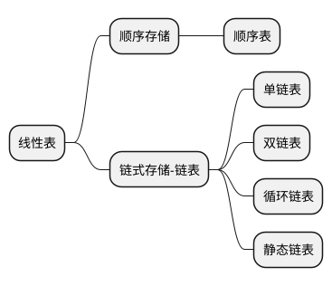

## 线性表-Linear



### 线性表的定义和操作

#### 线性表的定义

线性表是具有**相同**的数据类型的 $n(n \ge 0)$ 个 **有限序列**

$$
L = (a_{1},....a_{n})
$$

其中 $a_{1}$ 是唯一的“第一个”数据元素，又称**表头元素**， $a_{n}$ 是唯一的“最后一个”数据元素，又称**表尾元素**。除了**表头元素**，每个元素都有唯一的前驱。除了**表尾元素**，每一个元素都有唯一的后驱。以上就是线性表的**逻辑特性**。由此得到线性表的特点如下：

1. 表中元素的个数有限
2. 表中元素具有逻辑上的顺序性
3. 表中元素都是数据元素，每个元素都是单个元素
4. 表中元素数据类型都相同，意味着每一个元素都占有相同大小的存储空间
5. 表中元素具有抽象性，即仅讨论元素间的逻辑关系，而不考虑表示什么内容

> :imp:线性表是一种逻辑结构，表示元素之间一对一的相邻关系。顺序表和链表是指存储结构，是不同的概念。顺序表强调了内存上的关系。

#### 线性表的基本操作

```cpp
// 为线性表分配空间
void InitList(auto &L);
// 获取表长
int Length(auto L);
// 查找元素
void LocateElem(auto L,auto e);
auto GetElem(auto L,auto i);
// 添加元素
auto ListInsert(auto &L,auto i,auto e);
// 删除元素
auto ListDelete(auto &L,auto i,auto &e);
// 输出操作
void PrintList(auto L);
// 判空
void Empty(auto L);
// 销毁列表，归还空间
void DestroyList(auto &L);
```

> :ice_cream:对于线性表的各个类型的优势缺点，可以从 **查找** 和 **增加删除** 几个角度来分析。



- 线性表
  - 定义
    - 值得注意的事项
      - 数据元素<strong style="color:red;">同类型、有限、有序</strong>
    - 重要术语
      - 表头、空表
      - 表头、表尾
      - 前驱、后继
      - 数据元素的位序
  - 基本操作
    - 创建、销毁、增删改查（所有数据结构使用的记忆思路）
    - 判空、判长、打印输出



### 顺序表

线性表的 <strong style="color:red;"><u>顺序存储</u></strong> 又称顺序表。他是用一组地址连续的存储单元 <strong style="color:red;"> <u>依次</u></strong> 存储线性表中的数据元素，从而使得逻辑上相邻的两个元素在物理位置上也相邻。第 $1$ 个元素存储在线性表的起始位置，第 $i$ 个元素的存储位置后紧接着就是第 $i+1$ 个元素，称 $i$ 个元素 $a_{i}$ 为在线性表中的 <dfn style="color:blue;">位序</dfn>。因此，顺序表的特点是表中元素的逻辑顺序与其存储物理顺序相同。

$$
Loc(i) = Loc(0) + sizeof(ElemType)*i
$$

> :robot: 线性表中的元素的位序是从 **1** 开始的，而数组中元素的位序是从 **0** 开始的

一维数组可以是**静态分配**的，也可以是**动态分配**的。

- **静态分配**的时候，由于数组大小和空间事先固定，一旦空间占满，再加入新的数据就会产生溢出，进而导致程序崩溃。
- **动态分配**的时候，存储数组的空间是在执行过程中确认的，一旦数据空间占满了，就另外开辟一块更大的空间，用以替换原来的空间，从而达到扩充数组的目的，而不需要为线性表一次性划分所有的空间。
  - `cLang` 使用 `malloc`、`free` 来申请或者释放空间
  - `cpp` 可以使用 `new` ,`delete` 来申请或者释放空间

    > :rotating_light: 注意**动态分配**并不是链式存储，它同样属于顺序存储结构，物理结构并没有发生变化， 依然是随机读取的方式，只是分配的空间大小可以在运行时动态决定。

#### 优点

- 主要特点是随机读取，可以通过 $O(1)$ 内通过首地址和元素序号找到指定的元素。
- 存储密度高，每个节点只存储数据元素

#### 缺点

- 逻辑上相邻的元素物理上也相邻，所以插入元素和删除元素需要移动大量的元素

假定顺序表的元素类型为 `ElemType`，则线性表的顺序存储类型描述为：

##### 基本操作的实现

```cpp
#include <stdio.h>
#include <stdbool.h>

#define Maxsize 9999 // 线性表定义的最大长度
typedef int ElemType;

// 静态分配
typedef struct {
    ElemType data[Maxsize]; // 顺序表的元素
    int length; // 表长
} Sqlist; // 类型定义
// 动态分配
/**
*typedef struct {
*   ElemType *data;
*   int length;
*} Sqlist;
*/
// 基本操作 - 初始化一个顺序表
void InitList(Sqlist *L) {
    L->length = 0; // 顺序表初始长度为 0

    // 动态分配的时候为数组申请内存空间
    // L.data = (ElemType *)malloc(sizeof(ElemeType) * Maxsize);
    // 如果对于 CPP
    // L.data = new ElemType[Maxsize];
}
// 插入操作
/*
* @descriptor: 因为本人考 C Lang 所以用 C 的语法来写了
* @param { Sqlist } L  :操作的数组
* @param { int } index :插入的位序
* @param { ElemType } target :插入的对象
* @return {bool} : 插入成功就返回 true,如果出现空间已经被占满,就不能继续插入
**/
bool ListInsert(Sqlist *L, int index, ElemType target) {
    // 插入的位置根本不在考虑范围内
    if (index < 1 || index > L->length + 1) return false;

    // 如果”上头“插入过多了
    if (L->length >= Maxsize) return false;
 
    // 迭代查询到需要插入的位置，然后让这个位置的后面元素后面移
    for (int i = L->length; i >= index; i--) {
        L->data[i] = L->data[i - 1];
    }
    // or L.data[index-1] = target;
    L->data[index - 1] = target;
    L->length++;
    return true;
}
// 删除操作
/*
* @descriptor: 因为本人考 C Lang 所以用 C 的语法来写了
* @param { Sqlist } L  :操作的数组
* @param { int } index :删除的位序
* @param { ElemType } value :被删除的元素放在的地方
* @return {bool} : 删除成功就返回 true,如果不合法,就不能删除
**/
bool ListDelete(Sqlist *L, int index, ElemType *value) {
    // 判断是否合法
    if (index < 1 || index > L->length) return false;
    *value = L->data[index - 1];
    // 遍历 比如要删除第二个元素，index = 2
    // [ null, 1, 2, 3 ]
    // [ null, 1, 3,   ]
    // 这里取到的 i - 1 ，应该是王道书给到的位序在这里用的是位序为 1，但是是按照数组 
    for (int i = index; i < L->length; i++) {
        L->data[i - 1] = L->data[i];
    }
    L->length--;
    return true;
}
// 按值查找
/**
* @param { Sqlist } L  :操作的数组
* @param { ElemType } value :被删除的元素放在的地方
* @return {int} : 如果为 0 说明查找失败，需要注意的是 位序=索引+1
**/
int LocateElem(Sqlist *L,ElemType e) {
    // 进入循环查找
    for (int i=0;i<L->length;i++) {
        if ( L->data[i] == e ) return i+1; 
    }
    return 0;
}
// 函数入口
int main(void) {
    Sqlist *L;
    InitList(L);
    // 尝试”违规“打印出 data 数据，也就是溢出打印。
    // 超出 MaxSize 之后，就会出现莫名奇妙的数字（其实就是地址） 
    /*for (int i = 0; i<Maxsize+2 ; i++) {
    *   printf("data[%d]=%d\n",i,L.data[i]);  
    * }
    */
    // 纠正：👇
    for (int i = 0; i < L->length; i++) {
        printf("data[%d]=%d\n", i, L->data[i]);
    }
    return 0;
}

```

###### 插入情况分析

- 最好情况：直接表尾插入，不需要移动元素，时间复杂度为 $O(1)$
- **最坏情况**：需要在表头插入，需要移动 $n$ 个元素，时间复杂度为 $O(n)$
- **平均情况**：假设 $P_{i} = \frac {1} {(n+1)}$是在第 $i$ 个元素上插入一个节点的概率，则在长度为 $n$ 的线性表中插入一个结点时所需要移动的结点的平均次数（数学期望 $Ex$）为

$$
    \sum_{i=1}^{n+1} p_{i}(n-i+1)
    = \sum_{i=1}^{n+1} \frac {(n-i+1)} {n+1}
    = \frac {n+1} {n+1} *\frac {1} {n+1}*\sum_{i=1}^{n+1} -i
    =  \frac {n} {2}
$$

    因此，顺序表插入算法的平均时间复杂度是 $O({n})$

###### 删除操作情况分析

描述：删除顺序表 $L$ 中第 $i$ 个位置的元素，用引用变量 e 返回。若 $i$ 的输入不合法，则返回 `false`；否则，将被删的元素赋给 $e$，并将第 $i+1$ 个元素移动及其后的元素依次向前移动一个位置，返回 `true`

- 最好情况：直接删除表尾元素，不需要移动元素，时间复杂度为 $O(1)$
- **最坏情况**：需要删除表头元素，需要移动 $n$ 个元素，时间复杂度为 $O(n)$
- **平均情况**：假设 $P_{i} = \frac {1} {(n)}$是在第 $i$ 个元素上删除一个节点的概率，则在长度为 $n$ 的线性表中插入一个结点时所需要移动的结点的平均次数（数学期望 $Ex$）为

$$
    \sum_{i=1}^{n} p_{i}(n-i) = \sum_{i=1}^{n} \frac {(n-i)} {n}  = \frac {n} {n} *\frac {1} {n}*\sum_{i=1}^{n} -i
    = \frac {n-1} {2}
$$

### 链表



- 链表
  - 单链表
    - 定义-代码实现
    - 基本操作的实现
  - 双链表
  - 循环链表
  - 静态链表



> 线性表的链式存储又称**单链表**，它是指通过一组任意的存储单元来存储线性表中的数据元素。

#### 代码实现

```c
#include <stdbool.h>
#include <malloc.h>

// 链表结构体
typedef int ElemType;
typedef union {
    // 可能是链中链
    ElemType *L;
    ElemType data;
} Data;
struct LNode {
    Data data;
    struct LNode *next;
};
typedef struct LNode *LinkList;
typedef struct LNode Node;

Node *GetElm(LinkList L, int i) {
    Node *p = L->next;
    if (i == 0) return L;
    if (i < 1) return NULL;
    for (int j = 0; p && j < i; p = p->next, ++j);
    return p;
};

/**
 * 在第 i 个位置插入 e (带头结点)
 * */
bool ListInsert(LinkList L, int i, ElemType e) {
    if (i < 1) return false;
    Node *p = L;
    for (int j = 0; p && j < i - 1; p = p->next, ++j);
    if (!p) return false;
    Node *s = (LinkList) malloc(sizeof(Node));
    s->data.data = e;
    s->next = p->next;
    p->next = s;
    return true;
}
//..... 此处省略后续的 前插入，后插之类 的
```

##### 优点

- 利用单链表可以解决顺序表需要大量连续存储单元的缺点

##### 缺点

- 附加单链表附加指针域，也存在浪费存储空间的缺点。
- 非随机存取的存储结构，即不能直接找到表中某个特定的结点。--<strong style="color:red;">单向检索</strong>

> 关于 **头节点** 和 **头指针** 的区分：
>
> 不管带不带头节点，头指针都始终指向链表的第一个结点，而头节点是带头结点的链表中的第一个结点，结点内通常不存信息。
>
> 引入头节点之后，可以带来两个优点
>
> - 由于第一个数据节点的位置被存放在头节点的指针域中，因此在链表的第一个位置上的操作的其他位置上的操作一致，无须特殊处理。
> - 无论链表是否为空，其头指针都指向头节点的非空指针，因此空表和非空表的处理也就得到了统一。
