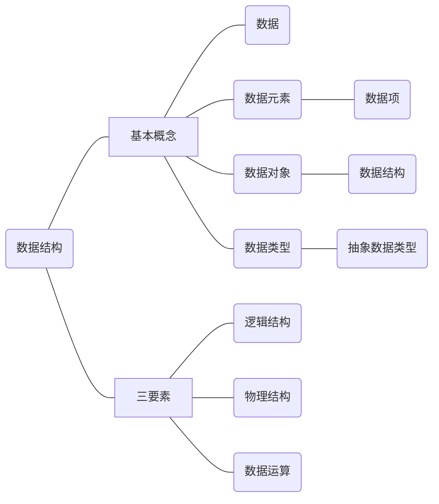

## 数据结构的基本概念



### 基本概念

- ***<u>数据元素</u>*** 是 **数据** 的 **基本单位**

- ***<u>数据项</u>*** 是 **数据元素** 不可分割的 **最小单位**

- ***<u>数据结构</u>*** 是 **相互之间** 存在一种或多种特定 <span style="color: #6efe7c;">关系</span> 的**数据元素 集合**

- ***<u>数据对象</u>*** 是具有 <span style="color: #6efe7c;">相同性质</span> 的数据元素的集合，是数据的一个子集。

### 三要素

- <u>***逻辑结构***</u>

    1. 集合：各个元素属于同一个集合，没有其他关系。
    2. 线性结构：元素之间是 **一对一** 的关系，除了第一个元素之外都有唯一的前驱。
    3. 树形结构：元素之间是 **一对多** 的关系
    4. 图状结构（网状结构）

- <u>***物理结构（存储结构）***</u>

    1. 顺序结构：各个数据元素在物理上必须是连续的。
    2. 链式存储：不要求逻辑上相邻的元素也相邻
    3. 索引存储
    4. 散列存储

    数据的存储结构会影响数据的方便程度

- <u>***数据运算***</u>



- 逻辑结构
  - 线性结构
        1. 一般线性表
        2. 受限线性表
            1. 栈
            2. 队列
        3. 线性表推广
  - 非线性结构
        1. 集合
        2. 树形结构
            1. 一般树
            2. 二叉树
        3. 图状结构
            1. 有向图
            2. 无向图
- 物理结构
  - 顺序结构
    - 优点
            1. 可以实现随机存取
            2. 每个元素占有最少的存储空间
    - 缺点
            1. 只能使用相邻的一整块存储单元，可能产生较多的存储碎片
  - 链式存储
    - 优点
            1. 不会出现碎片现象，能充分利用所有的存储单元
    - 缺点
            1. 每个元素因存储指针而占有额外的存储空间
            2. 只能实现顺序读取
  - 索引存储
    - 优点
            1. 检索速度很快
    - 缺点
            1. 附加的索引表额外占用存储空间
  - 散列存储
    - 优点
            1. 检索，增加和删除节点都很快
            2. 缺点
                1. 若是散列函数不好，则可能出现哈希冲突，存储单元冲突会增加时间开销和空间开销
                

## 算法的基本概念



### 什么是算法

- 程序 = 数据结构 + 算法
  - 数据结构是要处理信息
  - 算法是处理信息的步骤
- 算法的五大特性
    1. **有穷性**
        - 算法是有穷的
        - 程序可以是无穷的
    2. **确定性**
        - 相同输入只会产生相同的输出
    3. **可行性**
        - 可以用已有的基本操作实现算法
    4. **输入**
        - 丢给算法处理的数据
    5. **输出**
        - 算法处理的结果
- 好的算法的四大特质
    1. 正确性
        - 能正确处理问题
    2. 可读性
        - 对算法的描述要让其他人也看得懂
    3. 健壮性
        - 算法能处理一些异常状况
    4. 高效率与低的存储量需求
        - 即算法执行省时，省内存
        - 时间复杂度低，空间复杂低



### 算法时间复杂度

1. 加法规则
    $$
    T(n) = T_{1}(n) + T_{2}(n) \\
    = O(f(n) +g(n)) \\
    = O(max(fn(n),g(n)))
    $$

2. 乘法规则
    $$
    T(n) = T_{1}(n) * T_{2}(n) \\
     = O(f(n) * g(n))
    $$

    > :ice_cream: 也就是数量级叠加，常对幂指阶

#### 时间复杂度分类

- **<u style="color:red;">最坏时间复杂度</u>**：最坏的情况下，一般考察这个
- **<u style="color:red;">平均时间复杂度</u>**：所有输入示例的等概率出现的情况下，算法的期望运行时间。
- ~~最好时间复杂度~~：没啥用

#### 一些结论

1. 顺序执行代码只会影响常数项，可以忽略

2. 只需要挑循环中的一个 <u>**基本操作**</u> 分析他的执行次数与 $n$ 的关系

3. 如果有多层循环只需要关注 <u>**最深层**</u> 循环了几次

    ```cpp
    void find (int flag[],int n) {
        for (int i = 0l i < n; i++){
            if (flag[i] == n) {
                break; // 找到后跳出循环
            }
        }   
    }
    ```

### 空间复杂度

略
